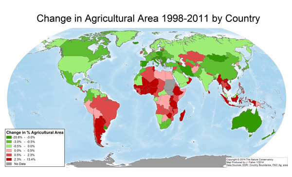

<meta charset = "UTF-8">
<style>
    body .main-container {
        max-width: 100%;
    }
    body .centered-image {
      display: block;
      margin-left: auto;
      margin-right: auto;
    }
    h1 {
      font-weight: bold;
    }
    h2 {
      font-weight: bold;
    }
    h3 {
      font-weight: bold;
    }
    h4 {
      font-weight: bold;
    }
    h5 {
      font-weight: bold;
    }
</style>

<!--Carga de PreRequisitos y Paquetes-->
```{r prerequisites, include=FALSE}
chooseCRANmirror(graphics=FALSE, ind=1)
#Sys.setlocale("LC_ALL", 'Spanish')
#Sys.setlocale("LC_MESSAGES", 'es_ES.UTF-8')

# Reset de variables de entorno
rm(list=ls())
# Limpieza de consolacls
cat("\014")
options(scipen=999)  # turn-off scientific notation like 1e+48
# Almacenamos instante de inicio de la ejecución para medición de tiempos
start_time <- Sys.time()
# Carga de packages
prerequisite_packages = c("rmarkdown", "shiny", "knitr", "data.table", "DT",
                          "here", "parallel", "bit64", "leaflet", "RColorBrewer",
                          "R.utils", "readr", "dplyr", "DT", "shinythemes", "psych", "FSA",
                          "fitdistrplus", "ggplot2", "car", "polycor", "ggpubr", "lmtest",
                          "nortest", "arm", "InformationValue", "olsrr", "leaps", "relaimpo",
                          "FSelector", "caret", "Boruta", "factoextra", "FactoMineR", "nFactors",
                          "MASS", "e1071", "klaR", "naivebayes", "bnlearn", "rpart", "party",
                          "C50", "partykit", "randomForest", "adabag", "tree", "gbm",
                          "caretEnsemble", "liquidSVM", "NbClust", "mclust", "fpc", "dbscan",
                          "ppclust", "kohonen", "gridExtra", "stats", "ggfortify", 
                          "uroot", "forecast", "tsoutliers", "bfast", "pryr", "kableExtra",
                          "openair", "rAmCharts", "stringi", "RColorBrewer", "sp", "maps", "mapdata",
                          "rgdal", "maptools", "raster", "zip")
# remove.packages(prerequisite_packages)
prerequisite_packages

# Comprueba packages que falten por instalar para funcionar e instala los que falten
new_packages <- prerequisite_packages[!(prerequisite_packages %in% installed.packages()[,"Package"])]
if (length(new_packages) > 0) {
  install.packages(new_packages, repos = "http://cran.us.r-project.org")
}

# Carga con library los paquetes necesarios
invisible(lapply(prerequisite_packages, library, character.only = TRUE))
update.packages(prerequisite_packages, repos = "http://cran.us.r-project.org")

# Semilla global para samples aleatorios
set.seed(32)

# Detección de núcleos con los que optimizar para
# las ejecuciones que sea posible realizar en paralelo
num_threads <- detectCores() - 1

```

<!-- Directorios necesarios-->
```{r output dirSetter, include=FALSE}
# Introduce los archivos necesarios
input_csv_name <- "NFA_2018.csv"
input_countries_csv_name <- "countries_of_the_world.csv"
print(getwd())
here()
project_wd <- paste0(here(), "/")
file_wd <- paste0(here(), "/src/")
setwd(file_wd)

# Directorios necesarios
input_data_dir <- paste0(file.path(project_wd), "/src/input/data")
output_dir <- paste0(file.path(project_wd), "/src/output")
input_csv_dir <- paste0(input_data_dir, "/CSV/")
input_csv_file <- paste0(input_csv_dir, input_csv_name)
input_countries_csv_file <- paste0(input_csv_dir, input_countries_csv_name)

dir_necesarios <- c(dirname(input_data_dir), input_data_dir, dirname(output_dir), output_dir)

```

<!-- Comprueba que todos los directorios necesarios existen -->
```{r dirChecker, include=FALSE}
for (i in dir_necesarios) {
  if (!dir.exists(i)) {
    dir.create(i)
  }
}

```

<!-- Configuración rmarkdown shiny -->
```{r setup, include=FALSE}
knitr::opts_chunk$set(echo = TRUE)
# (data_dir <- "../input/data")
# print(data_dir)
# output_dir <- "../output/start_p1_regresion_out"
# (normalizePath(output_dir, winslash ="/"))
# getwd()
# knitr::opts_knit$set(base.dir = output_dir)
# knitr::opts_knit$set(base.url = output_dir)
#knitr::opts_knit$set(header = "OUTPUT HEADER")
# identical(knitr::opts_knit$get("rmarkdown.runtime"), "shiny")
# opts_knit$get("base.dir")
#opts_knit$set(root.dir=normalizePath(output_dir, winslash = '/'), base.dir = normalizePath(output_dir, winslash = '/'), base.url = normalizePath(output_dir, winslash = '/'))
opts_knit$get("base.dir")

#knitr::opts_knit$set()
#knitr::opts_knit$set(base.dir = normalizePath(out, winslash = '/'))
# knitr::opts_chunk$set(fig.path = "figure/")
#library(knitr)
#knit("start_p1_regresion.Rmd", "output/start_p1_regresion_out/start_p1_regresion.md")
```

<!-- Carga de los datos de entrada de los datos de entrada-->
```{r inputDataLoad, echo=FALSE, include=FALSE}
# csv_input_data <- read.csv(input_csv_file)
getwd()
# setwd(file_wd)
# path.expand(input_csv_file)
csv_input_footprint_data <- fread(path.expand(input_csv_file),
                        header = T, sep = ",", dec = ".",
                        showProgress = T, nThread = num_threads, verbose = F, encoding = "UTF-8")
csv_input_countries_data <- fread(path.expand(input_countries_csv_file),
                        header = T, sep = ",", dec = ".",
                        showProgress = T, nThread = num_threads, verbose = F, encoding = "UTF-8")

raw_merged_data <- inner_join(csv_input_footprint_data, csv_input_countries_data, by = c("pais" = "pais"))
raw_world_merged_data <- left_join(csv_input_footprint_data, csv_input_countries_data, by = c("pais" = "pais"))

# Tabla con el cruce entre footprint y datos de países
# Limpieza de columnas inútiles o redundantes
clean_input_data <- raw_merged_data[, -c(2, 16)]
clean_input_data$poblacion_anual <- as.numeric(clean_input_data$poblacion_anual)

# Tabla con el cruce entre footprint y datos de países incluyendo footprints no interseccionados con los países
# Limpieza de columnas inútiles o redundantes
clean_world_input_data <- raw_world_merged_data[, -c(2, 16)]
clean_world_input_data$poblacion_anual <- as.numeric(clean_world_input_data$poblacion_anual)

# Tabla con datos sólo de footprints (temporales a lo largo de los años)
# Limpieza de columnas inútiles o redundantes
clean_footprint_input_data <- csv_input_footprint_data[, -c(2)]
clean_footprint_input_data$poblacion_anual <- as.numeric(clean_footprint_input_data$poblacion_anual)

# Tabla con datos sólo de países (atemporales)
# Limpieza de columnas inútiles o redundantes
clean_countries_input_data <- csv_input_countries_data[, -c(2)]

# setwd(project_wd)

# Subsettings y Limpieza
# loc_geografica <- subset(csv_input_data, select = c("latitude", "longitude"))
# Quita los que contengan algún NA
# loc_geografica <- head(loc_geografica[complete.cases(loc_geografica[ , 1:2]),], 50)
# loc_geografica <- loc_geografica[!is.na(loc_geografica),]
```


<hr>


# Introducción
<p>En este proyecto de análisis de datos se aborda un estudio en términos demográficos, económicos y de huella ecológica dedicada en consumo en los distintos países.</p>

<!-- ## Tabla completa de datos de entrada (Footprint + Countries) -->
<!-- Datos de entrada -->
<!-- <p>Ejemplo de tabla de huella ecológica de consumo con los 10 países con mayor PIB anual en 2010.</p> -->
```{r inputDataTable, echo = FALSE, include = FALSE}
# head_raw_table <- raw_world_merged_data[order(raw_world_merged_data$PIB_fijo_percap, decreasing = TRUE), ]
# head_raw_table <- head_raw_table[head_raw_table[, "anyo"] == ("2010"), ]
# head_raw_table <- head_raw_table[head_raw_table[, "tipoRegistro"] == ("EFConsTotGHA"), ]
# head_raw_table <- head(head_raw_table, n = 10)
# head_raw_table

# kable(head(raw_world_merged_data[order(raw_world_merged_data$PIB_fijo_percap), ], n = 10)) %>%
#   kable_styling(bootstrap_options = c("striped", "hover", "condensed", "responsive")) %>%
#   scroll_box(width = "1000px", height = "820px") %>% row_spec(0, angle = -45)


# suppressWarnings(DT::datatable(data = raw_world_merged_data,
#                                options = list(pageLength = 10,
#                                                 initComplete = JS("function(settings, json) {
#                                                                     $(this.api().table().header()).css({
#                                                                       'background-color': '#fff',
#                                                                       'color': '#00f'
#                                                                     });
#                                                                    }")),
#                                rownames = FALSE, filter = 'top', width = 600))


# library(shiny)
# library(dplyr)
# library(readr)
# load(url("http://s3.amazonaws.com/assets.datacamp.com/production/course_4850/datasets/movies.Rdata"))
# 
# # UI
# ui <- fluidPage(
#   sidebarLayout(
#     
#     # Input(s)
#     sidebarPanel(
#       
#       # Select filetype
#       radioButtons(inputId = "filetype",
#                    label = "Select filetype:",
#                    choices = c("csv", "tsv"),
#                    selected = "csv"),
#       
#       # Select variables to download
#       checkboxGroupInput(inputId = "selected_var",
#                          label = "Select variables:",
#                          choices = names(movies),
#                          selected = c("title"))
#       
#     ),
# 
#         
#     # Output(s)
#     mainPanel(
#       HTML("Select filetype and variables, then download and/or view the data."),
#       br(), br(),
#       downloadButton(outputId = "download_data", label = "Download data"),
#       br(), br(),
#       DT::dataTableOutput(outputId = "moviestable")
#     )
#   )
# )
# 
# # Server
# server <- function(input, output) {
#   
#   # Create reactive data frame
#   movies_selected <- reactive({
#     req(input$selected_var)               # ensure input$selected_var is available
#     movies %>% select(input$selected_var) # select columns of movies
#   })
#   
#   # Create data table
#   output$moviestable <- DT::renderDataTable({
#     DT::datatable(data = movies_selected(), 
#                   options = list(pageLength = 10), 
#                   rownames = FALSE)
#   })
#   
#   # Download file
#   output$download_data <- downloadHandler(
#     filename = function() {
#       paste0("movies.", input$filetype)
#     },
#     content = function(file) { 
#       if(input$filetype == "csv"){ 
#         write_csv(movies_selected(), path = file) 
#       }
#       if(input$filetype == "tsv"){ 
#         write_tsv(movies_selected(), path = file) 
#       }
#     }
#   )
#   
# }


# # UI
# ui <- fluidPage(
#   theme = shinytheme("cosmo"),
#   sidebarLayout(
#     # Input(s)
#     sidebarPanel(
#       # Select filetype
#       radioButtons(inputId = "filetype",
#                    label = "Seleccione formato de descarga de los datos:",
#                    choices = c("csv", "tsv"),
#                    selected = "csv"),
# 
#       # Select variables to download
#       checkboxGroupInput(inputId = "selected_var",
#                          label = "Seleccione los atributos a mostrar:",
#                          choices = names(raw_world_merged_data),
#                          selected = names(raw_world_merged_data)), 
#       width = 2
#     ),
# 
#     # Output(s)
#     mainPanel(
#       HTML('Haga click en "Descargar" para obtener los datos usados.'),
#       br(), br(),
#       downloadButton(outputId = "download_data", label = "Descargar"),
#       br(), br(),
#       DT::dataTableOutput(outputId = "input_data_DT")
#     )
#   )
# )
# 
# # Server
# server <- function(input, output) {
# 
#   # Create reactive data frame
#   input_selected_vars <- reactive({
#     req(input$selected_var)               # ensure input$selected_var is available
#     raw_world_merged_data %>% select(input$selected_var) # select columns of movies
#   })
# 
#   # Create data table
#   output$input_data_DT <- DT::renderDataTable({
#     DT::datatable(data = input_selected_vars(),
#                   options = list(pageLength = 10),
#                   rownames = FALSE)
#   })
# 
#   # Download file
#   output$download_data <- downloadHandler(
#     filename = function() {
#       paste0("input_data.", input$filetype)
#     },
#     content = function(file) {
#       if(input$filetype == "csv"){
#         write_csv(input_selected_vars(), path = file)
#       }
#       if(input$filetype == "tsv"){
#         write_tsv(input_selected_vars(), path = file)
#       }
#     }
#   )
# 
# }
# 
# Create a Shiny app object
# shinyApp(ui = ui, server = server,
#          options = list(height = 820))

# shinyApp(ui = ui, server = server)

```


## Análisis de datos de la huella ecológica de países a lo largo del tiempo del año 1961 a 2014

<p>La huella ecológica son las "hectáreas globales" dedicadas a distintos tipos de actividades (consumo, producción, importación, exportación y regeneración de recursos).</p>
<p>La huella ecológica o <b>hectáreas globales</b> se entienden como una medida de la superficie empleada en el uso de recursos <b>ponderada</b> mediante la "capacidad" de uso de esa superficie (no es equivalente una hectárea en el desierto que una hectárea de bosque).</p>
### Descripción de los datos de huella ecológica (Footprint)
<p>En este set de datos tenemos los registros de 196 países desde los años 1961 y 2014 como máximo (hay países donde no hay registro de ciertos atributos específicos para determinados años para evitar incluir datos no fiables).</p>
<p>Los registros incluyen un registro "World" que puede alterar nuestros datos por países, por lo que dichos registros y de determinados países de escasa estandarización serán eliminados de nuestro data set.</p>
<p>Para cada país, contamos con la huella ecológica (en términos de hectáreas globales totales y per capita) empleada en 5 tipos de actividades:</p>

<ol>
  <li><b>EFConsTotGHA / EFConsPerCap:</b> huella ecológica dedicada al <b>consumo,</b> también llamada simplemente huella ecológica.</li>
  <li><b>EFProdTotGHA / EFProdPerCap:</b> huella ecológica dedicada a la <b>producción.</b>
  <li><b>BiocapTotGHA / BiocapPerCap:</b> huella ecológica que aporta a la <b>regeneración de vida biológica/recursos (biocapacidad).</b> La biocapacidad es medida calculando la cantidad de tierras y mares biológicamente productivos disponibles para proveer de recursos a la población y para absorver sus residuos, dadas las tecnologías y prácticas de gestión actuales. Para que sea comparable a través de la localización y el tiempo, las áreas se han ajustado proporcionalmente a su productividad biológica. Estas áreas ajustadas son las denominadas "hectáreas globales". Dado que los países difieren en la productividad de sus ecosistemas, esto se verá reflejado en los registros.</li>
  <li><b>EFPImportsTotGHA / EFImportsPerCap:</b> huella ecológica dedicada a las <b>importaciones.</b></li>
  <li><b>EFExportsTotGHA / EFExportsPerCap:</b> huella ecológica dedicada a las <b>exportaciones.</b></li>
</ol>
<p>En los casos en que sea mejor un análisis específico para un tipo de actividad concreta, se enfocará el análisis en el consumo (EFCons...) y alternativamente en la regeneración de recursos (Biocap...)</p>
<p>Las columnas de "tierra_cultivo" a "carbon" son el número de hectáreas globales de este tipo de tierras requeridas para consumo, producción o biocapacidad. La columna "total" es la suma the todos estos valores</p>

<p>Es necesario señalar que el atributo "carbon" vale 0 en los registros de tipo de actividad "Biocapacity". Esto se debe a que la demanda de biocapacidad en términos de "carbon" está incluido y aportado en el atributo "tierra_bosques".</p>


<p>Atributos utilizados (totales y/o per capita):</p>
<ol>
  <li><b>pais:</b> nombre del país al que hace referencia el registro. <b>Cualitativo.</b></li>
  <li><b>continente:</b> continente al que pertenece el país. <b>Cualitativo.</b></li>
  <li><b>subcontinente:</b> subcontinente al que pertenece el país. <b>Cualitativo.</b></li>
  <li><b>anyo:</b> año del registro (el intervalo depende del país). <b>Cualitativo/Cuantitativo.</b></li>
  <li><b>tipoRegistro:</b> tipo de actividad (consumo, producción, biocapacidad, importación o exportación). <b>Cualitativo.</b></li>
  <li><b>tierra_cultivo:</b> hectáreas globales destinadas a la agricultura (cultivos y derivados de cultivos. Los valores de tierra_cultivo en actividad Biocapacity son los mismos que en Production porque todas las hectáreas de biocapacidad demandada en cultivos son las usadas para producción en tierras de cultivo. <b>Cuantitativo.</b></li>
  <li><b>tierra_ganaderia:</b>  hectáreas globales destinadas a la ganadería (carne, cuero, etc.). Incluye tierras usadas para ganado, pero no para las tierras cultivadas para alimento de ganado. <b>Cuantitativo.</b></li>
  <li><b>tierra_bosques:</b> hectáreas globales de bosques (para obtención de madera, celulosa y derivados de la madera). <b>Cuantitativo.</b></li>
  <li><b>extension_pesca:</b> hectáreas globales destinadas en extensión marina e infrastructuras terrestres para pesca (destinado a pesca y derivados de la pesca). <b>Cuantitativo.</b></li>
  <li><b>tierra_construida:</b> hectáreas globales construidas (tierra cubierta por insfrastructuras humanas). No incluye el comercio de infrastructuras ni inmuebles. Los valores en el tipo de actividad Biocapacity son los mismos que en Production porque el 100% de la biocapacidad cubierta es la demandada para cubrir la infrastructura de producción. <b>Cuantitativo.</b></li>
  <li><b>carbon:</b> hectáreas globales dedicadas al consumo de carbón, combustibles fósiles y muestra de las emisiones. <b>Cuantitativo.</b></li>
  <li><b>total:</b> suma de todos los tipos de tierras (hectáreas globales) de cada país para un año y tipo de actividad concreto. <b>Cuantitativo.</b></li>
  <li><b>PIB_anual_percap:</b> PIB anual del país basado en la constante del valor de USD de 2010. <b>Cuantitativo.</b></li>
  <li><b>poblacion_anual:</b> población anual del país (en miles de personas) estimada por la FAO. <b>Cuantitativo.</b></li>
</ol>

<p>Atributos descartados:</p>
<ol>
  <li><b>ISO alpha-3 code:</b> código. Descartado por irrelevancia.</li>
</ol>

### Unidades y metodología
<p>La única medida de este dataset es la hectárea global. Es una unidad de tierra normalizada mediante la productividad biológica a lo largo de los distintos tipos de actividad, tierras, país y año. Ésta es la unidad usada en detrimento de la hectárea física debido a la necesidad de comparar distintas regiones, tiempos y tipos de tierras en un mismo rango. Esta estrategia se apoya en la base de la metodología de cálculo de la huella ecológica</p>
<p>La huella ecológica de consumo registra las necesidades en cuanto a area requerido por el consumo (incluyendo producción mas importación menos exportación), mientras que la huella ecológica de producción registra sólo el área requerida para producción en el país.</p>
<p>Las huellas ecológicas de estos tipos de actividades se relacionan mediante la siguiente ecuación:</p>
<p><b>EF Consumption = EF Production + EF Imports - EF Exports</b></p>
<p>La huella ecológica de producción y comercio (importación + exportación) es la cantidad de hectáreas globales que son calculadas dedicadas a productos en cada país mediante el uso de enormes data sets de producción y comercio. Los valores de dichos productos son sumados y aplicados a la ecuación previamente descrita para cada tipo de tierra (cultivo, ganadería, etc.).</p>


### Fuentes y referencias
<p>Fuentes, referencias y mas información en <a href = "https://www.kaggle.com/footprintnetwork/national-footprint-accounts-2018">Kaggle Footprint Network 2018</a> y <a href = "https://www.footprintnetwork.org/resources/data/">Footprint Network</a>.</p> 


<hr>
## Análisis de datos de demográficos de los países en el año 2000

<p>Datos demográficos <b>atemporales</b> sobre población, economía, natalidad, mortalidad y alfabetización de los países.</p>
<p>Este dataset será utilizado por su posible relación y con los datos de producción y huella ecológica. Nos servirá tanto como dataset independiente para análisis como para complemento al dataset previo mediante el cruce de datos en base a los países. De esta manera podremos comparar conclusiones con relación semántica.</p>

### Descripción de los datos demográficos (Countries)
<p>En este set de datos tenemos los registros demográficos de países.</p>
<p>Los atributos para dichos registros y sus unidades presentan distinta naturaleza: económica, mortalidad, natalidad, población, consumo,...</p>


<p>Atributos utilizados:</p>
<ol>
  <li><b>pais:</b> nombre del país al que hace referencia el registro. <b>Cualitativo.</b></li>
  <li><b>poblacion_fija:</b> población del país (aprox. año 2000). <b>Cuantitativo.</b></li>
  <li><b>area:</b> área/extensión del país. <b>Cuantitativo.</b></li>
  <li><b>densidad_poblacion:</b> densidad poblacional del país. <b>Cuantitativo.</b></li>
  <li><b>ratio_area_costa:</b> ratio de cantidad de costa por área. <b>Cuantitativo.</b></li>
  <li><b>in_out_inmigracion:</b> tasa de inmigración. <b>Cuantitativo.</b></li>
  <li><b>mortalidad_infantil:</b> tasa de mortalidad infantil. <b>Cuantitativo.</b></li>
  <li><b>PIB_fijo_percap:</b>PIB per capita en USD. <b>Cualitativo</b></li>
  <li><b>alfabetizacion:</b> porcentaje de población alfabeta. <b>Cuantitativo.</b></li>
  <li><b>tel_moviles:</b> número de teléfonos móviles por cada mil habitantes. <b>Cuantitativo.</b></li>
  <li><b>terreno_cultivable_perc:</b> porcentaje de terreno cultivable. <b>Cuantitativo.</b></li>
  <li><b>cultivos_perc:</b> porcentaje de terrenos cultivados. <b>Cuantitativo.</b></li>
  <li><b>otros_perc:</b> porcentaje dedicado a otros usos. <b>Cuantitativo.</b></li>
  <li><b>clima:</b> tipo de clima generalizado del país. <b>Cualitativo/Cuantitativo.</b></li>
  <li><b>tasa_nacimiento:</b> tasa de nacimientos del país. <b>Cuantitativo.</b></li>
  <li><b>tasa_mortalidad:</b> tasa de mortalidad del país. <b>Cuantitativo.</b></li>
  <li><b>agricultura:</b> porcentaje de la actividad económica destinado a la agricultura. <b>Cuantitativo.</b></li>
  <li><b>industria:</b> aporcentaje de la actividad económica destinado a la industria. <b>Cuantitativo.</b></li>
  <li><b>servicios:</b> porcentaje de la actividad económica destinado al sector servicios. <b>Cuantitativo.</b></li>
</ol>
  
<p>Atributos descartados:</p>
<ol>
  <li><b>region:</b> código de región. Descartado por redundancia.</li>
</ol>

### Unidades y Metodología
<p>La tabla de datos fijos sobre los países contiene valores con distintas unidades para los distintos atributos.</p>
<p>A continuación se describen consideraciones adicionales necesarias.<p>
<ul>
  <li>El <b>área</b> del país está expresado en millas cuadradas.</li>
  <li>La <b>densidad de población</b> es medida en habitantes por milla cuadrada.</li>
  <li>El <b>ratio_area_costa</b> es expresado con un ratio de longitud de costa por area del país.</li>
  <li>Las <b>tasa de mortalidad infantil</b> está medida por cada 1000.</li>
  <li>El <b>producto interior bruto (PIB)</b> está medido en USD per capita.S</li>
  <li>La <b>alfabetización</b> es medida en porcentaje de la población total.</li>
  <li>El atributo <b>tel_moviles</b> está expresado como el número de teléfonos móviles por cada 1000 habitantes.</li>
  <li>El <b>terreno_cultivable_perc</b> es medido en términos de porcentaje del área del país.</li>
  <li>Los terrenos con <b>cultivos_perc</b> son expresados en términos de porcentaje del área del país.</li>
  <li>Las <b>tasa de natalidad y tasa de mortalidad</b> están medidas en nacimientos/muertes anuales por cada 1000 personas.</li>
  <li>La <b>agricultura</b> es expresada en términos de porcentaje de la actividad económica del país.</li>
</ul>



<p>Las descripciones de los distintos valores del atributo <b>clima</b> son las siguientes:</p>
<ol>
  <li>Tropicales secos, tundras y lugares helados. Clasificación B y E.</li>
  <li>Tropicales húmedos. Clasificación A.</li>
  <li>Temperaturas húmedas subtropicales y temperaturas continentales. Clasificación Cfa, Cwa, y D.</li>
  <li>Veranos secos calurosos e inviernos húmedos.</li>
</ol>


### Fuentes y referencias
<p>Fuentes, referencias y mas información en <a href = "https://www.kaggle.com/fernandol/countries-of-the-world">Kaggle Countries of the World</a> y <a href = "http://gsociology.icaap.org/dataupload.html">US Government Sociology Data Sets</a>.</p> 


<hr>
## Análisis conjunto
<p>En los casos aplicables, se hará un análisis conjunto y/o comparativo entre conclusiones de una y otra tabla de datos, así como cruzados, por su relación semántica. Se busca abordar también la posibilidad de relación entre la huella ecológica y datos adicionales demográficos.</p>

<p>No obstante, la correlación entre ambos datasets complementados será previsiblemente baja al tratarse de dos conjuntos de datos de naturaleza diferente, pues el primero se refiere a datos temporales (anuales) y el segundo a datos fijos.</p>


<hr>
## Objetivos
<p>Se definen los siguientes objetivos como propósito de nuestro análisis de los dos datasets relacionados (independiente y complementariamente).</p>
<p><b>Técnicos:</b></p>
<ol>
  <li>Análisis de indicadores estadísticos de los datos.</li>
  <li>Análisis de correlaciones lineales y no lineales.</li>
  <li>Generación de modelos lineales y no lineales.</li>
  <li>Predicción y clasificación mediante modelos lineales y no lineales.</li>
  <li>Análisis de importancia de atributos, limpieza de estos y reducción de la dimensionalidad.</li>
  <li>Clasificación, clusterización y predicción temporal.</li>
</ol>
<p><b>Semánticos:</b></p>
<ol>
  <li>Detectar correlaciones entre distintos atributos.</li>
  <li>Detectar evidencias y tendencias.</li>
  <li>Clasificar correctamente nuevos datos.</li>
  <li>Predecir correctamete los valores de nuevos datos temporales.</li>
</ol>

<p><b>Análisis:</b></p>
<p>A lo largo del desarrollo, la dirección de los análisis se ha ido definiendo basados en los atributos mas desatacables.</p>
<ol>
  <li>Identificar correlaciones entre huella total ecológica empleada en consumo, área de un país y su población anual.</li>
  <li>Identificar correlaciones entre tasa de nacimiento, tasa de mortalidad, porcentajes de dedicación de la economía (agricultura, industria y servicios), PIB per capita del país, nivel de alfabetización y número de teléfonos móviles por habitantes.</li>  <li>Clasificar correctamente nuevos datos.</li>
  <li>Clasificación, en base a etiquetas de tasa de natalidad alta a baja, de nuevos datos mediante el uso de modelos de regresión y redes de neuronas entrenadas.</li>
    <li>Agrupamiento de datos en base a características comunes de los atributos que influyan en la tasa de nacimiento.</li>
</ol>

<hr>
## Metodología de trabajo
<p>Dado el carácter recursivo y cíclico de un proyecto de análisis de datos, el proceso de trabajo será el de:</p>
<ol>
  <li>Visualización inicial de distintos atributos.</li>
  <li>Resúmenes estadísticos</li>
  <li>Correlaciones lineales</li>
  <li>Modelo regresión lineal</li>
  <li>Correlaciones no lineales</li>
  <li>Modelo regresión no lineal</li>
  <li>Selección de atrbutos post-analisis inicial</li>
  <li>Detección de outliners post-analisis inicial</li>
  <li>Reducción de la dimensionalidad post-analisis inicial</li>
  <li>Clasificación</li>
  <li>Clusterización</li>
  <li>Predicción de series temporales</li>
</ol>
<p>Estos pasos serán repetidos tras ajustes detectados en diferentes secciones.</p>
<p>Por este carácter cíclico, se presentan en las primeras fases de visualización, algunos ajustes acometidos en base a posteriores secciones como la de Correlación (hetcor()), Selección de atributos, Detección de Outliers y Reducción de la dimensionalidad.</p>

<p>La implicación directa de esta condición es que habiendo detectado las mejores tablas y atributos a utilizar para la identificación de correlaciones, centraremos nuestro análisis en las tablas de valores totales normalizados para las actividades de <b>Consumo</b> y <b>Producción</b> con NA siempre que sea posible.</p>
<p>En los casos en que no sea posible el uso de las tablas con NA para la aplicación de <b>modelos y entrenamientos</b>, usaremos las <b>tablas equivalentes sin valores NA</b></p>
<p>En los casos en que sea preferible una visualización de los <b>datos reales</b>, se utilizarán las <b>tablas de datos equivalentes sin normalizar.</b></p>

### Paquetes de R utilizados
```{r showPackages, echo = TRUE}
prerequisite_packages
```

<hr>
## Preparación de los datos
### Eliminación de NAs
<p>Se procede a la creación de tablas alternativas sin los datos de que contienen valores "NA".</p>
<p>Se realizará tanto para la tabla general como para un filtrado en el que se pierda un menor número de NAs (eliminando previamente atributos con mayor número de NAs a ignorar en posteriores análisis).</p>
<p>Se conserva la tabla de datos de entrada con los NAs para ser utilizado como un set mas completo en las funciones en que sea posible y/o los NAs no afecten.</p>

```{r naRemover, echo = TRUE}
print("Eliminación de columnas con valores NA:")
print("Tabla sin columnas de huella ecológica de tierras específicas (sólo total) ni de PIB anual (concentración mayoritaria de valores NA)")
noNaColCleanData <-  clean_input_data[, -c(6:11, 13)]

print("Tabla sin columnas de huella ecológica de tierras específicas (sólo total) (concentración mayoritaria de valores NA")
noNaColTierrasCleanData <-  clean_input_data[, -c(6:11)]
noNaColTierrasCleanFootprintData <-  clean_footprint_input_data[, -c(6:11)]

print("Tabla sin columnas de PIB anual (concentración mayoritaria de valores NA)")
noNaColPIBCleanData <-  clean_input_data[, -c(13)]

print("Tabla sin columnas de clima (concentración mayoritaria de valores NA)")
noNaColTodosCleanData <-  clean_input_data[, -c(6:11, 13, 27)]
noNaColCleanClimaCountriesData <-  clean_countries_input_data[, -c(14)]

print("Eliminación de filas con valores NA en ala tabla original:")
noNaFilCleanInputData <-  clean_input_data[complete.cases(clean_input_data), ]
naFilCleanInputData <- clean_input_data[!complete.cases(clean_input_data), ]
noNaFilCleanFootprintData <- clean_footprint_input_data[complete.cases(clean_footprint_input_data), ]
naFilCleanFootprintData <- clean_footprint_input_data[!complete.cases(clean_footprint_input_data), ]
noNaFilCleanCountriesData <- clean_countries_input_data[complete.cases(clean_countries_input_data), ]
naFilCleanCountriesData <- clean_countries_input_data[!complete.cases(clean_countries_input_data), ]

print("Eliminación de filas con valores NA en la tabla completa con columnas limpiadas:")
noNaFilColCleanInputData <-  noNaColTodosCleanData[complete.cases(noNaColTodosCleanData), ]
naFilColCleanInputData <- noNaColTodosCleanData[!complete.cases(noNaColTodosCleanData), ]
noNaFilColCleanFootprintData <- noNaColTierrasCleanFootprintData[complete.cases(noNaColTierrasCleanFootprintData), ]
naFilColCleanFootprintData <- noNaColTierrasCleanFootprintData[!complete.cases(noNaColTierrasCleanFootprintData), ]
noNaFilColCleanCountriesData <- noNaColCleanClimaCountriesData[complete.cases(noNaColCleanClimaCountriesData), ]
naFilColCleanCountriesData <- noNaColCleanClimaCountriesData[!complete.cases(noNaColCleanClimaCountriesData), ]
noNaFilColCleanTierrasData <- noNaColTierrasCleanData[complete.cases(noNaColTierrasCleanData), ]
naFilColCleanTierrasData <- noNaColTierrasCleanData[!complete.cases(noNaColTierrasCleanData), ]

```

### Normalización de los datos
<p>Normalización de los datos numéricos (rango de valores entre 0 y 1).</p>
```{r normalizer, echo = TRUE}
print("Normalización de tabla original con NAs:")
columnasNumericas <- c(6:32)
print("Maximos de cada columna")
maxValues <- apply(clean_input_data[, columnasNumericas], 2, function(x) max(x, na.rm = TRUE))
print("Minimos de cada columna")
minValues <- apply(clean_input_data[, columnasNumericas], 2, function(x) min(x, na.rm = TRUE))
print("Normalización")
normInputData <- mapply(function(a, b, c) {(a - b) / (c - b)}, a = clean_input_data[, columnasNumericas], b = minValues, c = maxValues)
# Conversion de matriz en dataframe
#class(normData)
normInputData <- as.data.frame(normInputData)
# Limpieza de NaNs por columnas con todo valores 0 que hacen fallar la formula por divisiones entre 0
# normInputData[is.na(normInputData)] <- 0
#class(normData)
inputCualitativas <- clean_input_data[, 1:5]
#left_join(normData, salidas, by = NULL)
normInputData <- data.frame(inputCualitativas, normInputData)


print("Normalización de tabla completa limpia sin NAs:")
columnasNumericasNoNa <- c(6:24)
print("Maximos de cada columna")
maxValuesNoNa <- apply(noNaFilColCleanInputData[, columnasNumericasNoNa], 2, function(x) max(x, na.rm = TRUE))
print("Minimos de cada columna")
minValuesNoNa <- apply(noNaFilColCleanInputData[, columnasNumericasNoNa], 2, function(x) min(x, na.rm = TRUE))
print("Normalización")
normNoNaInputData <- mapply(function(a, b, c) {(a - b) / (c - b)}, a = noNaFilColCleanInputData[, columnasNumericasNoNa], b = minValuesNoNa, c = maxValuesNoNa)
# Conversion de matriz en dataframe
normNoNaInputData <- as.data.frame(normNoNaInputData)
# Limpieza de NaNs por columnas con todo valores 0 que hacen fallar la formula por divisiones entre 0
noNaInputCualitativas <- noNaFilColCleanInputData[, 1:5]
normNoNaInputData <- data.frame(noNaInputCualitativas, normNoNaInputData)


# print("Normalización de tabla Footprint limpia sin NAs:")
# columnasNumericasNoNaFootprint <- c(6:8)
# print("Maximos de cada columna")
# maxValuesNoNaFootprint <- 
#   apply(noNaFilColCleanFootprintData[, columnasNumericasNoNaFootprint], 2, function(x) max(x, na.rm = TRUE))
# print("Minimos de cada columna")
# minValuesNoNaFootprint <- apply(noNaFilColCleanFootprintData[, columnasNumericasNoNaFootprint], 2, function(x) min(x, na.rm = TRUE))
# 
# print("Normalización")
# normNoNaFootprintInputData <- mapply(function(a, b, c) {(a - b) / (c - b)}, a = noNaFilColCleanFootprintData[, columnasNumericasNoNaFootprint], b = minValuesNoNaFootprint, c = maxValuesNoNaFootprint)
# 
# # Conversion de matriz en dataframe
# normNoNaFootprintInputData <- as.data.frame(normNoNaFootprintInputData)
# # Limpieza de NaNs por columnas con todo valores 0 que hacen fallar la formula por divisiones entre 0
# 
# inputNoNaFootprintCualitativas <- noNaFilColCleanFootprintData[, 1:5]
# normNoNaFootprintInputData <- data.frame(inputNoNaFootprintCualitativas, normNoNaFootprintInputData)
# 
# print("Normalización de tabla Countries limpia sin NAs:")
# columnasNumericasNoNaCountries <- c(2:18)
# print("Maximos de cada columna")
# maxValuesNoNaCountries <- apply(noNaFilColCleanCountriesData[, columnasNumericasNoNaCountries], 2, function(x) max(x, na.rm = TRUE))
# print("Minimos de cada columna")
# minValuesNoNaCountries <- apply(noNaFilColCleanCountriesData[, columnasNumericasNoNaCountries], 2, function(x) min(x, na.rm = TRUE))
# 
# print("Normalización")
# normCountriesInputData <- mapply(function(a, b, c) {(a - b) / (c - b)}, a = noNaFilColCleanCountriesData[, columnasNumericasNoNaCountries], b = minValuesNoNaCountries, c = maxValuesNoNaCountries)
# 
# # Conversion de matriz en dataframe
# normCountriesInputData <- as.data.frame(normCountriesInputData)
# # Limpieza de NaNs por columnas con todo valores 0 que hacen fallar la formula por divisiones entre 0
# 
# inputNoNaCountriesCualitativas <- noNaFilColCleanCountriesData[, 1]
# normCountriesInputData <- data.frame(inputNoNaCountriesCualitativas, normCountriesInputData)

```

### Separación de los datos por tipo de actividad
<p>Creación de tablas específicas para cada tipo de actividad (consumo, producción, importación, exportación y biocapacidad).</p>
```{r separaRecord, echo = TRUE}
print("Con la tabla sin normalizar:")
perCapInputData <- rbind(clean_input_data[clean_input_data[, "tipoRegistro"] == ("BiocapPerCap"), ],
                        clean_input_data[clean_input_data[, "tipoRegistro"] == ("EFConsPerCap"), ],
                        clean_input_data[clean_input_data[, "tipoRegistro"] == ("EFExportsPerCap"), ],
                        clean_input_data[clean_input_data[, "tipoRegistro"] == ("EFImportsPerCap"), ],
                        clean_input_data[clean_input_data[, "tipoRegistro"] == ("EFProdPerCap"), ]
                        )
totInputData <- rbind(clean_input_data[clean_input_data[, "tipoRegistro"] == ("BiocapTotGHA"), ],
                      clean_input_data[clean_input_data[, "tipoRegistro"] == ("EFConsTotGHA"), ],
                      clean_input_data[clean_input_data[, "tipoRegistro"] == ("EFExportsTotGHA"), ],
                      clean_input_data[clean_input_data[, "tipoRegistro"] == ("EFImportsTotGHA"), ],
                      clean_input_data[clean_input_data[, "tipoRegistro"] == ("EFProdTotGHA"), ]
                      )

totProduction <- clean_input_data[clean_input_data[, "tipoRegistro"] == ("EFProdTotGHA"), ]
totConsumption <- clean_input_data[clean_input_data[, "tipoRegistro"] == ("EFConsTotGHA"), ]
totBiocapacity <- clean_input_data[clean_input_data[, "tipoRegistro"] == ("BiocapTotGHA"), ]
totImports <- clean_input_data[clean_input_data[, "tipoRegistro"] == ("EFImportsTotGHA"), ]
totExports <- clean_input_data[clean_input_data[, "tipoRegistro"] == ("EFExportsTotGHA"), ]

perCapProduction <- clean_input_data[clean_input_data[, "tipoRegistro"] == ("EFProdPerCap"), ]
perCapConsumption <- clean_input_data[clean_input_data[, "tipoRegistro"] == ("EFConsPerCap"), ]
perCapBiocapacity <- clean_input_data[clean_input_data[, "tipoRegistro"] == ("BiocapPerCap"), ]
perCapImports <- clean_input_data[clean_input_data[, "tipoRegistro"] == ("EFImportsPerCap"), ]
perCapExports <- clean_input_data[clean_input_data[, "tipoRegistro"] == ("EFProdPerCap"), ]

print("Con la tabla normalizada:")
perCapNormInputData <- rbind(normInputData[normInputData[, "tipoRegistro"] == ("BiocapPerCap"), ],
                        normInputData[normInputData[, "tipoRegistro"] == ("EFConsPerCap"), ],
                        normInputData[normInputData[, "tipoRegistro"] == ("EFExportsPerCap"), ],
                        normInputData[normInputData[, "tipoRegistro"] == ("EFImportsPerCap"), ],
                        normInputData[normInputData[, "tipoRegistro"] == ("EFProdPerCap"), ]
                        )
totNormInputData <- rbind(normInputData[normInputData[, "tipoRegistro"] == ("BiocapTotGHA"), ],
                      normInputData[normInputData[, "tipoRegistro"] == ("EFConsTotGHA"), ],
                      normInputData[normInputData[, "tipoRegistro"] == ("EFExportsTotGHA"), ],
                      normInputData[normInputData[, "tipoRegistro"] == ("EFImportsTotGHA"), ],
                      normInputData[normInputData[, "tipoRegistro"] == ("EFProdTotGHA"), ]
                      )

totNormProduction <- normInputData[normInputData[, "tipoRegistro"] == ("EFProdTotGHA"), ]
totNormConsumption <- normInputData[normInputData[, "tipoRegistro"] == ("EFConsTotGHA"), ]
totNormBiocapacity <- normInputData[normInputData[, "tipoRegistro"] == ("BiocapTotGHA"), ]
totNormImports <- normInputData[normInputData[, "tipoRegistro"] == ("EFImportsTotGHA"), ]
totNormExports <- normInputData[normInputData[, "tipoRegistro"] == ("EFExportsTotGHA"), ]

perCapNormProduction <- normInputData[normInputData[, "tipoRegistro"] == ("EFProdPerCap"), ]
perCapNormConsumption <- normInputData[normInputData[, "tipoRegistro"] == ("EFConsPerCap"), ]
perCapNormBiocapacity <- normInputData[normInputData[, "tipoRegistro"] == ("BiocapPerCap"), ]
perCapNormImports <- normInputData[normInputData[, "tipoRegistro"] == ("EFImportsPerCap"), ]
perCapNormExports <- normInputData[normInputData[, "tipoRegistro"] == ("EFProdPerCap"), ]

print("Con la tabla normalizada sin NAs:")
perCapNoNaNormInputData <- rbind(normNoNaInputData[normNoNaInputData[, "tipoRegistro"] == ("BiocapPerCap"), ],
                        normNoNaInputData[normNoNaInputData[, "tipoRegistro"] == ("EFConsPerCap"), ],
                        normNoNaInputData[normNoNaInputData[, "tipoRegistro"] == ("EFExportsPerCap"), ],
                        normNoNaInputData[normNoNaInputData[, "tipoRegistro"] == ("EFImportsPerCap"), ],
                        normNoNaInputData[normNoNaInputData[, "tipoRegistro"] == ("EFProdPerCap"), ]
                        )
totNoNaNormInputData <- rbind(normNoNaInputData[normNoNaInputData[, "tipoRegistro"] == ("BiocapTotGHA"), ],
                      normNoNaInputData[normNoNaInputData[, "tipoRegistro"] == ("EFConsTotGHA"), ],
                      normNoNaInputData[normNoNaInputData[, "tipoRegistro"] == ("EFExportsTotGHA"), ],
                      normNoNaInputData[normNoNaInputData[, "tipoRegistro"] == ("EFImportsTotGHA"), ],
                      normNoNaInputData[normNoNaInputData[, "tipoRegistro"] == ("EFProdTotGHA"), ]
                      )

totNoNaNormProduction <- normNoNaInputData[normNoNaInputData[, "tipoRegistro"] == ("EFProdTotGHA"), ]
totNoNaNormConsumption <- normNoNaInputData[normNoNaInputData[, "tipoRegistro"] == ("EFConsTotGHA"), ]
totNoNaNormBiocapacity <- normNoNaInputData[normNoNaInputData[, "tipoRegistro"] == ("BiocapTotGHA"), ]
totNoNaNormImports <- normNoNaInputData[normNoNaInputData[, "tipoRegistro"] == ("EFImportsTotGHA"), ]
totNoNaNormExports <- normNoNaInputData[normNoNaInputData[, "tipoRegistro"] == ("EFExportsTotGHA"), ]

perCapNoNaNormProduction <- normNoNaInputData[normNoNaInputData[, "tipoRegistro"] == ("EFProdPerCap"), ]
perCapNoNaNormConsumption <- normNoNaInputData[normNoNaInputData[, "tipoRegistro"] == ("EFConsPerCap"), ]
perCapNoNaNormBiocapacity <- normNoNaInputData[normNoNaInputData[, "tipoRegistro"] == ("BiocapPerCap"), ]
perCapNoNaNormImports <- normNoNaInputData[normNoNaInputData[, "tipoRegistro"] == ("EFImportsPerCap"), ]
perCapNoNaNormExports <- normNoNaInputData[normNoNaInputData[, "tipoRegistro"] == ("EFProdPerCap"), ]

```

<!-- Backup de datos de entrada-->
```{r inputDataBackup, echo = FALSE, include = FALSE}
# csv_input_data <- read.csv(input_csv_file)
getwd()
# # setwd(file_wd)
# # path.expand(input_csv_file)
# fwrite(csv_input_footprint_data, file = paste0(output_dir, "/p1_out/CSV/InputData_backup.csv"), sep = ",",
#        row.names = T, nThread = num_threads, showProgress = T, verbose = F, buffMB = 8)
# fwrite(raw_merged_data, file = paste0(output_dir, "/p1_out/CSV/RawMergedData_backup.csv"), sep = ",",
#        row.names = T, nThread = num_threads, showProgress = T, verbose = F, buffMB = 8)

# # Datos limpios y Datos normalizados
# fwrite(clean_input_data, file = paste0(output_dir, "/p1_out/CSV/CleanMergedData_backup.csv"), sep = ",",
#        row.names = T, nThread = num_threads, showProgress = T, verbose = F, buffMB = 8)
# fwrite(normInputData, file = paste0(output_dir, "/p1_out/CSV/TotInputData_backup.csv"), sep = ",",
#        row.names = T, nThread = num_threads, showProgress = T, verbose = F, buffMB = 8)
# # save.image(file = paste0(output_dir, "/p1_out/RData/tidyInputData_backup.RData"))
# 
# # setwd(project_wd)

```


<hr>
# Estadística Descriptiva
## Indicadores estadísticos (tabla completa). describe() ("psych")
<p>A continuación se muestran los indicadores estadísticos sobre los valores de la tabla de Consumo</p>
<p>Nos permite ver medias, concentraciones, medianas, rangos y ajustes a forma de campana (Kurtosis).</p>
<p>Para favorecer el significado de los valores, ha sido aplicado sobre los datos in normalizar</p>
```{r describePsych, echo = TRUE, include=TRUE}
suppressWarnings(
  describe(totConsumption, na.rm = TRUE, interp = FALSE, skew = TRUE, ranges = TRUE, trim = .1,
              type = 3, check = TRUE, fast = NULL, quant = NULL, IQR = TRUE, omit = TRUE)
)

```

## Indicacores estadísticos (atributo). Summarize() ("FSA")
<p>Indicadores estadísticos para un atributo.</p>
<p>El mismo caso anterior pero aplicado sólo a un atributo de la tabla. En este caso, sobre el atributo total (tierras huella ecológicas totales empleadas en consumo).</p>
```{r summarizeFSA, echo = TRUE}
print("Indicadores estadisticos de superficie usada para consumo de recursos")
Summarize(totConsumption$total)

```

## Ajuste de distribución. descdist() ("fitdistrplus")
<p>Semejanza en cuanto ajuste de distribución de los datos a las funciones mas comunes (exponencial, gaussiana, etc.).</p>
<p>Concretamente, evaluaremos el atributo total (tierras totales) de consumo per capita.</p>
```{r descdist, echo = TRUE}
descdist(perCapConsumption$total)

```
<p>Vemos que se acerca a una distribución exponencial</p>

## Distribución. qqnorm()
<p>Q-Q Plot de la variable total de recursos per capita empleados en consumo.</p>
```{r qqnorm, echo = TRUE}
suppressWarnings(
  qqnorm(perCapConsumption$total)
)

```

## Tabla de contingencia
<p>Tabla de contingencia con el número de registros según climas y continentes.</p>
```{r tablasContingencia, echo = TRUE}
inputContingTable <- table(perCapConsumption$continente,
                           perCapConsumption$clima)
inputContingTable
mosaicplot(inputContingTable, shade = TRUE, main = "Tabla de contingencia", xlab = "Subcontinente", ylab = "Clima")

```


<hr>
# Correlación
## scatterplot
<p>Aquí se pueden apreciar fácilmente las diferencias de consumo per capita entre NorteAmérica y Europa frente al resto de continentes, así como que en los primeros está decreciendo mientras que en Asia creciendo.</p>
```{r scatterPlotConsumo, echo = TRUE}
# theme_set(theme_bw())  # pre-set the bw theme.

# Scatterplot
gg <- ggplot(perCapConsumption, aes(x = anyo, y = total, col = continente)) +
  geom_smooth(method = "loess", se = F) + 
  labs(subtitle = "(per capita)",
       y = "Huella ecológica Total de Consumo (hectáreas globales)",
       x = "Año",
       col = "Continente",
       title = "Huella ecológica del Consumo en el tiempo",
       caption = "ScatterPlot")

suppressWarnings(plot(gg))

```

<p>A continuación podemos ver cómo la <b>huella ecológica mundial neta (no per capita)</b> del consumo y de la producción es mayor que la la superficie empleada para renovable su regeneración de los recursos (BioCapacity), indicando una tendencia poco sostenible.</p>
```{r scatterBioCapConsumo, echo = TRUE}
# theme_set(theme_bw())  # pre-set the bw theme.

# Scatterplot
gg <- ggplot(totInputData, aes(x = anyo, y = total, col = tipoRegistro)) +
  geom_smooth(method = "loess", se = F) + 
  labs(subtitle = "(totales netas)",
       y = "Huella ecológica total (hectáreas globales)",
       x = "Año",
       col = "Tipo de actividad",
       title = "Huella ecológica total por tipo de actividades en el tiempo",
       caption = "ScatterPlot")

suppressWarnings(plot(gg))

```

## smoothScatter()
<p> Gráfico de densidad de color del total de huella ecológica empleada en Consumo. Sirve para ver en qué rango de valores están los registros de las distintas posiciones de la tabla.</p>
```{r smootScatter, echo = TRUE}
suppressWarnings(smoothScatter(perCapConsumption$total))

```

## scatterplotMatrix() ("car")
<p>En este caso, para ver la correlación, compararemos medidas totales netas en vez de per capita.</p>
<p>Podemos apreciar la lógica correlación entre la población y el total de la huella ecológica empleada en consumo y la empleada en cultivos, además de haber una ligera correlación entre la huella y la población (hay casos en los que no).</p>
```{r scatterplotMatrix, echo = TRUE}
scatterplotMatrix(~ total + tierra_cultivo + poblacion_anual, data = totNormConsumption)


# scatterplotMatrix(~ tierra_cultivo +	 tierra_ganaderia +	 tierra_bosques +	 extension_pesca +	 tierra_construida +	 carbon +	 total +	 PIB_anual_percap +	 poblacion_anual, data = totConsumption)

# scatterplotMatrix(~ poblacion_fija +	 area +	 densidad_poblacion +	 ratio_area_costa +	 in_out_inmigracion +	 mortalidad_infantil +	 PIB_fijo_percap +	 alfabetizacion +	 tel_moviles +	 terreno_cultivable_perc +	 cultivos_perc +	 otros_perc +	 clima +	 tasa_nacimiento +	 tasa_mortalidad +	 agricultura +	 industria +	 servicios, data = totConsumption)


```

## cov() cor()
<p>Vemos que es mejor usar cor() porque te da un índice entre 0 1 de la correlación entre las variables, por lo que no depende de si los datos están normalizados (primer caso) o no (segundo caso)</p>
<p>No obstante, de ahora en adelante, para la evaluación de correlaciones, usaremos preferiblemente los datos normalizados para poder comparar en un mismo rango de valores.</p>
```{r covcor, echo = TRUE}
print("Covarianza con datos normalizados.")
cov(totNormConsumption$total, totNormConsumption$tierra_cultivo, use = "complete.obs")
print("Correlación con datos normalizados.")
cor(totNormConsumption$total, totNormConsumption$tierra_cultivo, use = "complete.obs")
print("Covarianza sin datos normalizados.")
cov(totConsumption$total, totConsumption$tierra_cultivo, use = "complete.obs")
print("Correlación sin datos normalizados.")
cor(totConsumption$total, totConsumption$tierra_cultivo, use = "complete.obs")

```

## hetcor() ("polycor")
<p>Cálculo de correlaciones entre todas las variables (sólo código: sin salida para evitar falta de claridad).</p>
<p>Correlación Pearson</p>
```{r hetcorCor, echo = TRUE}
print("Correlaciones entre atributos de registros de consumo (totales sin normalizar).")
# suppressWarnings(correlacionesTotCons <- hetcor(totConsumption[, 6:32]))
# correlacionesTotCons

print("Correlaciones entre atributos de registros de consumo (per capita sin normalizar).")
# suppressWarnings(correlacionesPerCapCons <- hetcor(perCapConsumption[, 6:32]))
# correlacionesPerCapCons

print("Correlaciones entre atributos de registros de la tabla completa con todas las actividades (per capita normalizados).")
# suppressWarnings(correlPerCapNormAllActivities <- hetcor(perCapNormInputData[, 6:32]))
# correlPerCapNormAllActivities

print("Correlaciones entre atributos de registros de la tabla completa con todas las actividades (totales normalizados).")
# suppressWarnings(correlTotNormAllActivities <- hetcor(totNormInputData[, 6:32], use = "pairwise.complete.obs"))
# correlTotNormAllActivities

print("Correlaciones entre atributos de registros de consumo (totales normalizados) sin tierras especificas ni PIB anual (para evitar alteraciones por NAs).")
# suppressWarnings(correlTotNoNaNormNoNaCons <- hetcor(totNoNaNormConsumption[, 6:24]))
# correlTotNoNaNormNoNaCons

print("Correlaciones entre atributos de registros de consumo (totales normalizados).")
suppressWarnings(correlTotNormCons <- hetcor(totNormConsumption[, 6:32]))
# correlTotNormCons

print("Correlaciones entre atributos de registros de producción (totales normalizados).")
suppressWarnings(correlTotNormProd <- hetcor(totNormProduction[, 6:32]))
# correlTotNormProd

print("Correlaciones entre atributos de registros de biocapacidad (totales normalizados).")
# suppressWarnings(correlTotNormBio <- hetcor(totNormBiocapacity[, 6:32], use = "pairwise.complete.obs"))
# correlTotNormBio

print("Correlaciones entre atributos de registros de importaciones (totales normalizados).")
# suppressWarnings(correlTotNormImpo <- hetcor(totNormImports[, 6:32]))
# correlTotNormImpo

print("Correlaciones entre atributos de registros de exportaciones (totales normalizados).")
# suppressWarnings(correlTotNormExpo <- hetcor(totNormExports[, 6:32]))
# correlTotNormExpo

```
<p>Se ha llevado a cabo una comparación de los valores de las correlaciones entre los distintos atributos ejecutados sobre distinas tablas de datos:</p>
<ul>
  <li>per capita</li>
  <li>totales</li>
  <li>para todos los tipos de actividad (consumo, producción, etc.)</li>
  <li>para tipos de actividad específicos</li>
  <li>con valores NA</li>
  <li>sin valores NA</li>
</ul>
<p>Sobre las tablas mas convenientes para utilizar, de los distintos experimentos se deduce:</p>
<ul>
  <li>Que las tablas que mejores correlaciones reflejan son las que manejan valores en términos <b>totales</b> (no per capita), </b>normalizados</b>, <b>incluyendo valores NA</b> y <b>específicos para cada tipo de actividad</b> (resultado lógico por ser los casos en que los datos están dentro de una misma naturaleza). Este será el tipo d etabla utilizada en las funciones en que se toleren NA para mantener la mayor fidelidad en cantidad de registros.</li>
  <li>Que la <b>tabla sin NA</b> (menos atributos para conseguir mantener mas registros) guarda correlaciones parejas a la que sí tiene NA (correlaciones un poco mas débiles), por lo que cumple los requisitos para ser usada para modelos de regresión que requieran una tabla sin valores NA.</li>
  <li>Que para concretar y así poder profundizar nuestro análisis, <b>nos centraremos en los datos sobre consumo y sobre producción.</b></li>
</ul>

### Correlaciones destacables Footprint
<p>Correlaciones consideradas como destacables: 0.7 - 1</p>
<p><b>Consumo</b></p>
<p><b>tierra_ganadería - tierra_cultivo - tierra_bosques - extension_pesca - tierra_construida - carbon - poblacion_anual - area - total</b></p>
<p>Entre todas ellas, existe correlación directa, lo cual es lógico al ser en unidades totales (per capita), a mas tierras usadas para un tipo de suelo en consumo, mas usadas en otros tipos de suelos, en total y en mayores áreas.</p>
<p>Además, conviene destacar la relación directa entre la población ese año del país y el resto de atributos sobre la huella ecológica.</p>
    
<p><b>Producción</b></p>
<p><b>tierra_ganadería - tierra_cultivo - tierra_bosques - extension_pesca - tierra_construida - carbon - poblacion_anual - area - total</b></p>
<p>Entre todas ellas, existe correlación directa, lo cual es lógico al ser en unidades totales (per capita), a mas tierras usadas para un tipo de suelo en consumo, mas usadas en otros tipos de suelos, en total y en mayores áreas.</p>
<p>Además, conviene destacar la relación directa entre la población ese año del país y el resto de atributos sobre la huella ecológica.</p>

### Correlaciones destacables Countries
<p>Correlaciones consideradas como destacables: 0.7 - 1</p>
<p><b>alfabetización / servicios / tel_moviles / PIB_fijo_percap - mortalidad_infantil / tasa_nacimiento / agricultura (-)</b></p>
<p>Correlaciones inversas demográficas (cuanto mas de un atributo, menos del otro).</p>

### Correlaciones destacables conjuntas
<p>Correlaciones consideradas como destacables: 0.7 - 1</p>
<p><b>tel_moviles - PIB_anual_percap</b></p>
<p>Existe una relación directa entre el número de móviles por cada 1000 personas y el PIB per capita tanto anual como en un año concreto.</p>

## ScatterPlot Correlación
<p>Vemos gráficamente la correlación entre el PIB y el número de teléfonos por cada 1000 habitantes</p>
```{r scatterCorrelacion, echo = TRUE}
# Scatterplot
gg <- ggplot(perCapConsumption, aes(x = tel_moviles, y = PIB_fijo_percap)) +
  geom_smooth(method = "loess", se = F) + 
  labs(subtitle = "Correlación = 0.9226",
       y = "PIB ($ per capita)",
       x = "Nº teléfonos móviles por cada 1000 habitantes",
       title = "Nº de teléfonos móviles en relación con el PIB",
       caption = "ScatterPlot")

suppressWarnings(plot(gg))

```

## ggscatter ("ggpubr") y lm() - Modelo Lineal
<p>Vemos los parámetros a (pendiente) y b (coeficiente) del modelo lineal que mejor se ajusta a la correlación entre el número de teléfonos por 1000 habitantes y el PIB per capita</p>
<p>También podemos ver gráficamente el error del modelo lineal</p>
```{r ggscatterLM, echo = TRUE}
# ggscatter()

phoneLinearModel <- lm(tel_moviles ~ PIB_fijo_percap, perCapConsumption)
phoneLinearModel
print("Media del error (cercana al 0)")
mean(phoneLinearModel$residuals)
print("En los gráficos podemos ver un ajuste en cuanto a residuos del modelo lineal bastante aceptable en cuanto a uniformidad.")
plot(phoneLinearModel)

```

## step(lm()) - Modelo Lineal
<p>Modelo lineal con variables compuestas por la el número de teléfonos móviles, el PIB y la tasa de natalidad. De  nuevo, aparecen indicados los ecoeficientes de la funciónd e ajuste del modelo.</p>
```{r stepLM, echo = TRUE}
suppressWarnings(step(lm(tel_moviles ~ PIB_fijo_percap + tasa_nacimiento,
                         data = perCapNormConsumption),
                      direction = "both"))

```

## dwtest(lm()), acf() y tests de residuos - Modelo Lineal
<p>Análisis de los residuos del modelo lineal creado.</p>
```{r testResiduos, echo = TRUE}
dwtest(phoneLinearModel)
acf(phoneLinearModel$residuals)
print("Varianza:")
var(perCapNormConsumption$PIB_fijo_percap)
ad.test(phoneLinearModel$residuals) 
suppressWarnings(cvm.test(phoneLinearModel$residuals))
lillie.test(phoneLinearModel$residuals) 
```


<hr>
#Correlación no lineal
## Gráfica no lineal
<p>Visualización de la correlación no lineal (exponencial).</p>
```{r scatterPlotNoLineal, echo = TRUE}
# Scatterplot
# max(totConsumption$PIB_fijo_percap)
# prueba <- perCapConsumption[order(perCapConsumption$PIB_fijo_percap, decreasing = TRUE), ]
gg <- ggplot(totConsumption, aes(x = poblacion_anual, y = total)) +
  geom_smooth(method = "loess", se = F) + 
  labs(subtitle = "Correlación no lineal",
       y = "Total de hectáreas globales usadas en consumo",
       x = "Población anual del país",
       title = "Correlación no lineal población del país anual y total de de huella para consumo",
       caption = "ScatterPlot")

suppressWarnings(plot(gg))

```

## Plots de residuos de modelos no lineales()
```{r plotNoLineal, echo = TRUE}
print("Modelo lineal")
phoneLinearModel <- lm(tel_moviles ~ PIB_fijo_percap, perCapConsumption)
phoneLinearModel
print("Media del error (cercana al 0)")
mean(phoneLinearModel$residuals)
plot(phoneLinearModel)

print("Modelo no lineal exponencial")
poblacionExpMod <- glm(log(poblacion_anual) ~ total, data = totConsumption, 
              family=gaussian(link="identity"))
poblacionExpMod
plot(poblacionExpMod)

print("Modelo no lineal polinómico")
poblacionPolyMod <- glm((tierra_bosques * tierra_bosques) ~ PIB_anual_percap, data = totConsumption, 
              family=gaussian(link="identity"))
poblacionPolyMod
display(poblacionExpMod)
plot(poblacionPolyMod)
```

## Predicción según modelos lineales y no lineales. predict()
<p>Predicciones de los modelos</p>
```{r predict, echo = TRUE}
print("Predicción de la lineal")
poblacionLinTrainMod <- lm(poblacion_anual ~ total,
                      head(totConsumption, (nrow(totConsumption) - 10)))
new_predict_Lin_total <- data.frame(tail(totConsumption[complete.cases(totConsumption), ], 10))
# Predicción de los últimos 10 registros en base al modelo
poblacionLinPredict <- suppressWarnings(predict(poblacionLinTrainMod, newdata = new_predict_Lin_total))
# poblacionLinPredict <- data.frame(row.names(poblacionLinPredict), poblacionLinPredict)
poblacionLinPredict

print("Predicción de la no lineal exponencial")
poblacionExpTrainMod <- lm(log(poblacion_anual) ~ total,
                      head(totConsumption, (nrow(totConsumption) - 10)))
new_predict_Exp_total <- data.frame(tail(totConsumption[complete.cases(totConsumption), ], 10))
# Predicción de los últimos 10 registros en base al modelo
poblacionExpPredict <- suppressWarnings(predict(poblacionExpTrainMod, newdata = new_predict_Exp_total))
# poblacionExpPredict <- data.frame(row.names(poblacionExpPredict), poblacionExpPredict)
poblacionExpPredict

print("Predicción de la no lineal polinómica")
poblacionPolyTrainMod <- lm((poblacion_anual * poblacion_anual) ~ total,
                      head(totConsumption, (nrow(totConsumption) - 10)))
new_predict_Poly_total <- data.frame(tail(totConsumption[complete.cases(totConsumption), ], 10))
# Predicción de los últimos 10 registros en base al modelo
poblacionPolyPredict <- suppressWarnings(predict(poblacionPolyTrainMod, newdata = new_predict_Poly_total))
# poblacionExpPredict <- data.frame(row.names(poblacionExpPredict), poblacionExpPredict)
poblacionPolyPredict

# ggplot(iris, aes(x = Petal.Width, y = Sepal.Length)) + 
#   geom_point() +
#   stat_smooth(method = "lm", col = "red")
# 
# suppressWarnings(plot(gg))

```

## Modelos de regresiónlineales y no lineales con. fit_glm()
```{r fit_glm, echo = TRUE}
print("Lineal")
fit_glm_lin <- glm(poblacion_anual ~ total, data = totConsumption, family = gaussian)
fit_glm_lin
print("No lineal logarítmica con binario de variables independientes compuestas")
fit_log <- glm(poblacion_anual ~ total, data = totConsumption, family = gaussian(link = "log"))
fit_log

```

## Matriz de confusión. confusionMatrix() ("InformationValue"). Para binarias: No Aplica
```{r confusionMatrix, echo = TRUE}
# corteOptimo <- optimalCutoff(as.numeric(poblacion_anual_UMBRAL)-1,  fit_log$fitted.values,  optimiseFor  = 
# "Ones")[1] 
#  
# confusionMatrix(as.numeric(poblacion_anual_UMBRAL)-1, fit_log$fitted.values, threshold = corteOptimo) 

```

## Modelo no lineal poisson con atributo dependiente contable (cuantitativo)
<p>No lineal logarítmica</p>
```{r glmFitPoisson, echo = TRUE}
fit_poi <- glm(poblacion_anual ~ total, data = totConsumption, family = gaussian(link = "log"))
fit_poi
drop1(fit_poi, test = "F")

```


<hr>
# Outliers
<p>Para las siguientes secciones, <b>usaraemos las tablas sin NA</b></p>
## Visualización de atípicos. Boxplots
<p>Box-plots para visualizar datos atípicos.</p>
```{r detectOutliers, echo = TRUE}
print("Entre PIB per capita y número de móviles por 1000 habitantes.")
print("Rango intercuartílico de 1.5")
boxplot(totNoNaNormConsumption$tel_moviles,
        totNoNaNormConsumption$PIB_fijo_percap,
        names = c("Huella ecológica total del Consumo\n(Hectáreas globales)",
                  expression(Poblacion[Anual])), range = 1.5)

print("Entre tasa de nacimientos y número de móviles por 1000 habitantes.")
print("Rango intercuartílico de 1.5")
boxplot(totNoNaNormConsumption$tel_moviles,
        totNoNaNormConsumption$tasa_nacimiento,
        names = c("Huella ecológica total del Consumo\n(Hectáreas globales)",
                  expression(Poblacion[Anual])), range = 1.5)

print("Entre poblacion total y huella ecológica total.")
print("Rango intercuartílico de 3")
boxplot(totNoNaNormConsumption$total,
        totNoNaNormConsumption$poblacion_anual,
        names = c("Huella ecológica total del Consumo\n(Hectáreas globales)",
                  expression(Poblacion[Anual])), range = 1.5)

```


## Distancia de Cook. lm()
<p>Importancia de cada valor sobre una regresión lineal y <b>detección de atípicos (outliers)</b> para limpieza de los datos.</p>
```{r cookDistanceLM, echo = TRUE}
print("Evaluación sobbre modelo de tierras totales y poblacion anual")
print("Modelo de regresión de la tabla de consumo:")
fit_lm_cook_cons <- lm(total ~ poblacion_anual, data = totNoNaNormConsumption) 

print("Cálculo de la distancia de Cook de la tabla de consumo:")
cook_lm_cons <- cooks.distance(fit_lm_cook_cons)

print("Visualización de la distancia de Cook de la tabla de consumo:")
plot(cook_lm_cons, pch = "o", cex = 0.5, main = "Distancia de Cook")  
abline(h = 4 * mean(cook_lm_cons), col = "red")  # línea de corte 
text(x = 1 : length(cook_lm_cons) + 1, y = cook_lm_cons - 0.005, cex = 0.75, 
     labels = ifelse(cook_lm_cons > 4 * mean(cook_lm_cons), 
paste0(names(cook_lm_cons)), ""), col="red")

print("Threshold de la distancia de Cook de la tabla de consumo:")
print(cookThresholdCons <- mean(cook_lm_cons * 4))

print("Filas con atípicos de la tabla de consumo:")
atipicosCookCons <- cbind(as.data.frame(cook_lm_cons),
                       row(as.data.frame(cook_lm_cons)))
atipicosCookCons <- atipicosCookCons[atipicosCookCons$cook_lm_cons > cookThresholdCons, ]
colnames(atipicosCookCons) <- c("cook_distane", "nFila")
# atipicosCookCons


print("Modelo de regresión de la tabla de producción:")
fit_lm_cook_prod <- lm(total ~ poblacion_anual, data = totNoNaNormProduction) 

print("Cálculo de la distancia de Cook de la tabla de producción:")
cook_lm_prod <- cooks.distance(fit_lm_cook_prod)

print("Visualización de la distancia de Cook de la tabla de producción:")
plot(cook_lm_prod, pch = "o", cex = 0.5, main = "Distancia de Cook")  
abline(h = 4 * mean(cook_lm_prod), col = "red")  # línea de corte 
text(x = 1 : length(cook_lm_prod) + 1, y = cook_lm_prod - 0.005, cex = 0.75, 
     labels = ifelse(cook_lm_prod > 4 * mean(cook_lm_prod), 
paste0(names(cook_lm_prod)), ""), col="red")

print("Threshold de la distancia de Cook de la tabla de producción:")
print(cookThresholdProd <- mean(cook_lm_prod * 4))

print("Filas con atípicos de la tabla de producción:")
atipicosCookProd <- cbind(as.data.frame(cook_lm_prod),
                       row(as.data.frame(cook_lm_prod)))
atipicosCookProd <- atipicosCookProd[atipicosCookProd$cook_lm_prod > cookThresholdProd, ]
colnames(atipicosCookProd) <- c("cook_distane", "nFila")
# atipicosCookProd


print("Modelo de regresión de la tabla de moviles-natalidad para tabla de producción:")
fit_lm_cook_mov_nat_prod <- lm(tasa_nacimiento ~ tel_moviles, data = totNoNaNormProduction) 

print("Cálculo de la distancia de Cook de la tabla de moviles-natalidad para tabla de producción:")
cook_lm_mov_nat_prod <- cooks.distance(fit_lm_cook_mov_nat_prod)

print("Visualización de la distancia de Cook de la tabla de moviles-natalidad para tabla de producción:")
plot(cook_lm_mov_nat_prod, pch = "o", cex = 0.5, main = "Distancia de Cook")  
abline(h = 4 * mean(cook_lm_mov_nat_prod), col = "red")  # línea de corte 
text(x = 1 : length(cook_lm_mov_nat_prod) + 1, y = cook_lm_mov_nat_prod - 0.005, cex = 0.75, 
     labels = ifelse(cook_lm_mov_nat_prod > 4 * mean(cook_lm_mov_nat_prod), 
paste0(names(cook_lm_mov_nat_prod),"|",round(totNoNaNormProduction$total[as.numeric(names(cook_lm_mov_nat_prod))],
0)), ""), col="red")

print("Threshold de la distancia de Cook de la tabla de moviles-natalidad para tabla de producción:")
print(cookThresholdMovNatProd <- mean(cook_lm_mov_nat_prod * 4))

print("Filas con atípicos de la tabla de moviles-natalidad para tabla de producción:")
atipicosCookMovNatProd <- cbind(as.data.frame(cook_lm_mov_nat_prod),
                       row(as.data.frame(cook_lm_mov_nat_prod)))
atipicosCookMovNatProd <- atipicosCookMovNatProd[atipicosCookMovNatProd$cook_lm_mov_nat_prod > cookThresholdMovNatProd, ]
colnames(atipicosCookMovNatProd) <- c("cook_distane", "nFila")
# atipicosCookMovNatProd


print("Modelo de regresión de la tabla de moviles-natalidad para tabla de consumo:")
fit_lm_cook_mov_nat_cons <- lm(tasa_nacimiento ~ tel_moviles, data = totNoNaNormConsumption) 

print("Cálculo de la distancia de Cook de la tabla de moviles-natalidad para tabla de consumo:")
cook_lm_mov_nat_cons <- cooks.distance(fit_lm_cook_mov_nat_cons)

print("Visualización de la distancia de Cook de la tabla de moviles-natalidad para tabla de consumo:")
plot(cook_lm_mov_nat_cons, pch = "o", cex = 0.5, main = "Distancia de Cook")  
abline(h = 4 * mean(cook_lm_mov_nat_cons), col = "red")  # línea de corte 
text(x = 1 : length(cook_lm_mov_nat_cons) + 1, y = cook_lm_mov_nat_prod - 0.005, cex = 0.75, 
     labels = ifelse(cook_lm_mov_nat_cons > 4 * mean(cook_lm_mov_nat_cons), 
paste0(names(cook_lm_mov_nat_cons),"|",round(totNoNaNormConsumption$total[as.numeric(names(cook_lm_mov_nat_cons))],
0)), ""), col="red")

print("Threshold de la distancia de Cook de la tabla de moviles-natalidad para tabla de consumo:")
print(cookThresholdMovNatCons <- mean(cook_lm_mov_nat_cons * 4))

print("Filas con atípicos de la tabla de moviles-natalidad para tabla de consumo:")
atipicosCookMovNatCons <- cbind(as.data.frame(cook_lm_mov_nat_cons),
                       row(as.data.frame(cook_lm_mov_nat_cons)))
atipicosCookMovNatCons <- atipicosCookMovNatCons[atipicosCookMovNatCons$cook_lm_mov_nat_cons > cookThresholdMovNatCons, ]
colnames(atipicosCookMovNatCons) <- c("cook_distane", "nFila")
# atipicosCookMovNatCons


print("Creación de tablas de consumo y producción limpias sin los atípicos detectados")
atipicosCookCons <- rbind(atipicosCookCons, atipicosCookMovNatCons)
atipicosCookProd <- rbind(atipicosCookProd, atipicosCookMovNatProd)

cookCleanConsumption <- totNoNaNormConsumption[-atipicosCookCons$nFila, ]
cookCleanProduction <- totNoNaNormProduction[-atipicosCookProd$nFila, ]


print("Comprobación de mejor ajuste con menos atípicos en total-poblacion_anual (tabla Consumo):")
fit_lm_cook_cons <- lm(total ~ poblacion_anual, data = cookCleanConsumption) 

print("Cálculo de la distancia de Cook de la tabla de consumo:")
cook_lm_cons <- cooks.distance(fit_lm_cook_cons)

print("Visualización de la distancia de Cook de la tabla de consumo:")
plot(cook_lm_cons, pch = "o", cex = 0.5, main = "Distancia de Cook")  
abline(h = 4 * mean(cook_lm_cons), col = "red")  # línea de corte 
text(x = 1 : length(cook_lm_cons) + 1, y = cook_lm_cons - 0.005, cex = 0.75, 
     labels = ifelse(cook_lm_cons > 4 * mean(cook_lm_cons), 
paste0(names(cook_lm_cons)), ""), col="red")


```

## Distancia de Cook. ols_plot_cooksd_bar ("olsrr")
<p>Importancia de cada valor sobre la regresión lineal. Sirve para detectar atípicos.</p>
```{r cookDistanceOLS, echo = TRUE}
print("Modelo poblacion-tierras huella ecológica totales (tabla Consumo)")
fit_lm_cook_cons <- lm(total ~ poblacion_anual, data = cookCleanConsumption) 
out_cook_pobl_cons <- ols_plot_cooksd_bar(fit_lm_cook_cons) 

print("Modelo poblacion-tierras huella ecológica totales (tabla Producción)")
fit_lm_cook_prod <- lm(total ~ poblacion_anual, data = cookCleanProduction) 
out_cook_pobl_prod <- ols_plot_cooksd_bar(fit_lm_cook_prod) 

print("Modelo moviles-nacimientos (tabla Consumo)")
fit_lm_cook_mov_nat_cons <- lm(tasa_nacimiento ~ tel_moviles, data = cookCleanConsumption) 
out_cook_mov_cons <- ols_plot_cooksd_bar(fit_lm_cook_mov_nat_cons) 

print("Modelo moviles-nacimientos (tabla Producción)")
fit_lm_cook_mov_nat_prod <- lm(total ~ poblacion_anual, data = cookCleanProduction) 
out_cook_mov_prod <- ols_plot_cooksd_bar(fit_lm_cook_mov_nat_prod) 

```

## Medida DFBETA
<p>Impacto de cada valor sobre sobre los coeficientes de la regresión lineal. Sirve para detectar atípicos.</p>
```{r cookDistanceDFBETA, echo = TRUE}
print("Modelo poblacion-tierras huella ecológica totales (tabla Consumo)")
ols_plot_dfbetas(fit_lm_cook_cons) 
print("Modelo poblacion-tierras huella ecológica totales (tabla Producción)")
ols_plot_dfbetas(fit_lm_cook_prod) 
print("Modelo moviles-nacimientos (tabla Consumo)")
ols_plot_dfbetas(fit_lm_cook_mov_nat_cons) 
print("Modelo moviles-nacimientos (tabla Producción)")
ols_plot_dfbetas(fit_lm_cook_mov_nat_prod) 

```


## Gráfico de residuos eliminados estudentizados
<p>Impacto de cada valor sobre sobre los coeficientes de la regresión lineal</p>
```{r residuosEstudentizados, echo = TRUE}
print("Modelo poblacion-tierras huella ecológica totales (tabla Consumo)")

residuosEstudentizadosCons <- ols_plot_resid_stud(fit_lm_cook_cons)
print("Modelo poblacion-tierras huella ecológica totales (tabla Producción)")

residuosEstudentizadosProd <- ols_plot_resid_stud(fit_lm_cook_prod)
print("Modelo moviles-nacimientos (tabla Consumo)")
residuosEstudentizadosMovCons <- ols_plot_resid_stud(fit_lm_cook_mov_nat_cons)
print("Modelo moviles-nacimientos (tabla Producción)")
residuosEstudentizadosMovProd <- ols_plot_resid_stud(fit_lm_cook_mov_nat_prod)

```


## Nivel de Apalancamiento (Leverage) VS Residuos estudentizados
<p>Permite aclarar si determinados datos son puntos de apalancamiento, atípicos o ambos</p>
```{r modelLeverage, echo = TRUE}
print("Modelo poblacion-tierras huella ecológica totales (tabla Consumo)")
ols_plot_resid_lev(fit_lm_cook_cons)
print("Modelo poblacion-tierras huella ecológica totales (tabla Producción)")
ols_plot_resid_lev(fit_lm_cook_prod)
print("Modelo moviles-nacimientos (tabla Consumo)")
ols_plot_resid_lev(fit_lm_cook_mov_nat_cons)
print("Modelo moviles-nacimientos (tabla Producción)")
ols_plot_resid_lev(fit_lm_cook_mov_nat_prod)

```


<hr>
# Selección de atributos
## Aplicación de un subconjunto de atributos a un modelo. regsubsets() ("leaps")
<p>Subdivisión de los datos en subsets</p>
```{r selAtributos, echo = TRUE}
fit_leaps <- regsubsets(tel_moviles ~ tasa_nacimiento + alfabetizacion, data = cookCleanConsumption, nbest = 2)  
summary(fit_leaps) 
par(mfrow=c(1,2)) 
plot(fit_leaps, scale = "r2") 

# Evitada ejecución por alto tiempo de carga
# subsets(fit_leaps, statistic = "rss") 
```

## Importancia de los atributos. calc.relimp() ("relaimpo")
<p>Detección de los atributos mas influyentes en el comportamiento de otro atributo concreto.</p>
```{r selAtributosCompuestos, echo = TRUE}
print('Importancia de los atributos en relación al atributo total de tierras de huella ecológica (Consumo):')
# suppressWarnings(importancia <- calc.relimp(lm(total ~ poblacion_anual + area + densidad_poblacion + ratio_area_costa + in_out_inmigracion + mortalidad_infantil + PIB_fijo_percap + alfabetizacion + tel_moviles + terreno_cultivable_perc + cultivos_perc + otros_perc + tasa_nacimiento + tasa_mortalidad + agricultura + industria + servicios,
#                               data = cookCleanConsumption),
#                            type = c("lmg", "last", "first", "betasq",
#                                     "pratt", "genizi", "car"),
#                            rela = TRUE)) 
suppressWarnings(importancia <- calc.relimp(lm(total ~ poblacion_anual + area + alfabetizacion + tel_moviles + terreno_cultivable_perc + cultivos_perc + agricultura + industria + servicios,
                              data = cookCleanConsumption),
                           type = c("lmg", "last", "first", "betasq",
                                    "pratt", "genizi", "car"),
                           rela = TRUE)) 
 
importancia 
plot(importancia)
print("Los atributos mas influyentes en la huella ecológica de consumo son: poblacion_anual y area")

print('Importancia de los atributos en relación al atributo total de tierras de huella ecológica (Producción):')
suppressWarnings(importancia <- calc.relimp(lm(total ~ poblacion_anual + area + alfabetizacion + tel_moviles + terreno_cultivable_perc + cultivos_perc + agricultura + industria + servicios,
                              data = cookCleanProduction),
                           type = c("lmg", "last", "first", "betasq",
                                    "pratt", "genizi", "car"),
                           rela = TRUE)) 
 
importancia 
plot(importancia)
print("Los atributos mas influyentes en la huella ecológica de producción son: poblacion_anual y area")


print('Importancia de los atributos en relación al atributo tasa_nacimientos:')
suppressWarnings(importancia <- calc.relimp(lm(tasa_nacimiento ~ mortalidad_infantil + PIB_fijo_percap + alfabetizacion + tel_moviles + terreno_cultivable_perc + cultivos_perc + agricultura + industria + servicios,
                              data = cookCleanConsumption),
                           type = c("lmg", "last", "first", "betasq",
                                    "pratt", "genizi", "car"),
                           rela = TRUE))
 
importancia 
plot(importancia) 
print("Los atributos mas influyentes en la tasa de nacimientos son: mortalidad_infantil, alfabetizacion y tel_moviles")

print('Importancia de los atributos en relación al atributo tel_moviles:')
suppressWarnings(importancia <- calc.relimp(lm(tel_moviles ~ mortalidad_infantil + PIB_fijo_percap + alfabetizacion + terreno_cultivable_perc + cultivos_perc + tasa_nacimiento + tasa_mortalidad,
                              data = cookCleanConsumption),
                           type = c("lmg", "last", "first", "betasq",
                                    "pratt", "genizi", "car"),
                           rela = TRUE))
 
importancia 
plot(importancia) 
print("Los atributos mas influyentes en el número de teléfonos móviles son: PIB, alfabetizacion y tasa_nacimiento")


print('Importancia de los atributos en relación al atributo alfabetizacion:')
suppressWarnings(importancia <- calc.relimp(lm(alfabetizacion ~ mortalidad_infantil + PIB_fijo_percap + tel_moviles + terreno_cultivable_perc + cultivos_perc + tasa_nacimiento + tasa_mortalidad + agricultura + industria + servicios,
                              data = cookCleanConsumption),
                           type = c("lmg", "last", "first", "betasq",
                                    "pratt", "genizi", "car"),
                           rela = TRUE))
 
importancia 
plot(importancia) 
print("Los atributos mas influyentes en la tasa de alfabetización son: tasa_nacimiento, alfabetización y mortalidad infantiil")


```

## Factorización de valores cuantitativos con etiquetas. cut()
<p>Etiquetado por rangos de los valores de varios atributos.</p>
```{r selAtributosCut, echo = TRUE}
# totNormConsumption$Tipo_PIB_cut  <-  cut(totNormConsumption$PIB_anual_percap,
#                                      c(min(totNormConsumption$PIB_anual_percap),
#                                        min(totNormConsumption$PIB_anual_percap)75, 100, 
#                                        max(totNormConsumption$PIB_anual_percap)), include.lowest = TRUE, 
#                                      right = FALSE, labels = c("PIB_Bajo", "PIB_Medio", "PIB_Alto"))

cleanTaggedCons <- cookCleanConsumption
cleanTaggedProd <- cookCleanProduction


print("Etiquetado por 3 cortes de mayor a menor en base a la tasa de nacimiento")
cleanTaggedCons$tasa_nac_cut  <-  cut(cookCleanConsumption$tasa_nacimiento, breaks = 3,
                                         include.lowest = TRUE,right = FALSE,
                                         labels = c("Alta", "Media", "Baja"))
cleanTaggedProd$tasa_nac_cut  <-  cut(cookCleanProduction$tasa_nacimiento, breaks = 3,
                                         include.lowest = TRUE,right = FALSE,
                                         labels = c("Alta", "Media", "Baja"))

print("Etiquetado por 3 cortes de mayor a menor en base a la tasa de alfabetización")
cleanTaggedCons$tasa_alfabet_cut  <-  cut(cookCleanConsumption$alfabetizacion, breaks = 3,
                                         include.lowest = TRUE,right = FALSE,
                                         labels = c("Alta", "Media", "Baja"))
cleanTaggedProd$tasa_alfabet_cut  <-  cut(cookCleanProduction$alfabetizacion, breaks = 3,
                                         include.lowest = TRUE,right = FALSE,
                                         labels = c("Alta", "Media", "Baja"))

print("Etiquetado por 3 cortes de mayor a menor en base a la poblacion_anual")
cleanTaggedCons$poblacion_anual_cut  <-  cut(cookCleanConsumption$poblacion_anual, breaks = 3,
                                         include.lowest = TRUE,right = FALSE,
                                         labels = c("Alta", "Media", "Baja"))
cleanTaggedProd$poblacion_anual_cut  <-  cut(cookCleanProduction$poblacion_anual, breaks = 3,
                                         include.lowest = TRUE,right = FALSE,
                                         labels = c("Alta", "Media", "Baja"))

print("Etiquetado por 3 cortes de mayor a menor en base a la area")
cleanTaggedCons$area_cut  <-  cut(cookCleanConsumption$area, breaks = 3,
                                         include.lowest = TRUE,right = FALSE,
                                         labels = c("Alta", "Media", "Baja"))
cleanTaggedProd$area_cut  <-  cut(cookCleanProduction$area, breaks = 3,
                                         include.lowest = TRUE,right = FALSE,
                                         labels = c("Alta", "Media", "Baja"))

print("Etiquetado por 3 cortes de mayor a menor en base a la huella ecológica total")
cleanTaggedCons$total_cut  <-  cut(cookCleanConsumption$total, breaks = 3,
                                         include.lowest = TRUE,right = FALSE,
                                         labels = c("Alta", "Media", "Baja"))
cleanTaggedProd$total_cut  <-  cut(cookCleanProduction$total, breaks = 3,
                                         include.lowest = TRUE,right = FALSE,
                                         labels = c("Alta", "Media", "Baja"))

print("Etiquetado por 3 cortes de mayor a menor en base al PIB_anual_percap")
cleanTaggedCons$PIB_anual_cut  <-  cut(cookCleanConsumption$PIB_fijo_percap, breaks = 3,
                                         include.lowest = TRUE,right = FALSE,
                                         labels = c("Alto", "Medio", "Bajo"))
cleanTaggedProd$PIB_anual_cut  <-  cut(cookCleanProduction$PIB_fijo_percap, breaks = 3,
                                         include.lowest = TRUE,right = FALSE,
                                         labels = c("Alto", "Medio", "Bajo"))

# dfMedidas$Dia_sem_num <- as.numeric(Dia_sem) 

```

## Algoritmos de selección de atributos. ("FSelector")
<p>Análisis de importancia de los atributos para predecir el comportamiento de otro concreto.</p>
```{r selAtributosFSelector, echo = TRUE}
set.seed(10) 
print("Centraremos nuestro análisis en la tasa de nacimiento")
atributos  <-  colnames(cleanTaggedCons)
atributos <- atributos[1:30]
formula <- as.simple.formula(atributos, "tasa_nacimiento") 

print("Ordenación por importancia (con information.gain())")
importancia_IG <- information.gain(formula, cleanTaggedCons)
importancia_IG

print("Ordenación por importancia (con gain.ratio())")
importancia_GR <- gain.ratio(formula, cleanTaggedCons)
importancia_GR

print("Ordenación por importancia (con symmetrical.uncertainty())")
importancia_SU <- symmetrical.uncertainty(formula, cleanTaggedCons)
importancia_SU

# Ordenación por con criterio embebido (por ejemplo, random.forest.importance())
# Tipo mean decrease in acuracy
# rf_imp1 <- random.forest.importance(formula, cleanTaggedCons, importance.type = 1)
# Tipo mean decrease in node impurity
# rf_imp2 <- random.forest.importance(formula, cleanTaggedCons, importance.type = 2) 

```

## Selección de mejor subconjunto de datos con wrapper. ("cfs")
<p></p>
```{r selAtributosWrapper, echo = TRUE}
print("El mejor subconjunto para describir la tasa de natalidad es mortalidad_infantil y  agricultura")
formula_nacimiento <- as.simple.formula(atributos[-c(13)], "tasa_nacimiento") 
suppressWarnings(subset_CFS  <- cfs(formula_nacimiento, cleanTaggedCons) )
subset_CFS

print("El mejor subconjunto para describir la tasa de alfabetizacion es:")
formula_alfabet <- as.simple.formula(atributos, "alfabetizacion") 
suppressWarnings(subset_CFS  <- cfs(formula_alfabet, cleanTaggedCons)) 
subset_CFS

print("El mejor subconjunto para describir el poblacion_anual es:")
formula_poblac <- as.simple.formula(atributos[-c(8)], "poblacion_anual") 
suppressWarnings(subset_CFS  <- cfs(formula_poblac, cleanTaggedCons)) 
subset_CFS

print("El mejor subconjunto para describir el pais es:")
formula_pais <- as.simple.formula(atributos[-c(1, 8, 9)], "pais") 
suppressWarnings(subset_CFS  <- cfs(formula_pais, cleanTaggedCons)) 
subset_CFS

print("El mejor subconjunto para describir el PIB_fijo_percap es:")
formula_PIB <- as.simple.formula(atributos, "PIB_fijo_percap") 
suppressWarnings(subset_CFS  <- cfs(formula_PIB, cleanTaggedCons))
subset_CFS

print("El mejor subconjunto para describir el total de huella ecológica de consumo es:")
formula_tot_cons <- as.simple.formula(atributos, "total") 
suppressWarnings(subset_CFS  <- cfs(formula_tot_cons, cleanTaggedCons))
subset_CFS

print("El mejor subconjunto para describir la el total de huella ecológica de producción es:")
formula_tot_prod <- as.simple.formula(atributos, "total") 
suppressWarnings(subset_CFS  <- cfs(formula_tot_prod, cleanTaggedProd))
subset_CFS

```

## Descenso del gradiente como algoritmo de búsqueda. hill.climbing.search()
<p>Uso del algoritmo de búsqueda hill climbing enfocado en la tasa de nacimiento</p>
```{r selAtributosGradiente, echo = TRUE}
evaluator <- function(atributos) {
  formula <- as.simple.formula(atributos[-c(13)], "tasa_nacimiento") 
  suppressWarnings(subset_CFS  <- cfs(formula, cleanTaggedCons) )
  return(subset_CFS)
}
  
# suppressWarnings(subset <- hill.climbing.search(atributos, evaluator))
# f <- as.simple.formula(subset, "tasa_nacimiento")
```

## Selección de atributos con ("caret")
<p>Para poder hacer entrenamientos, antes dividiremos nuestros datos en 3 sets de datos (tras una previa aleatorización).</p>
<ul>
  <li><b>Training</b> (70% de 75%)</li>
  <li><b>Validation</b> (30% de 75%)</li>
  <li><b>Test</b> (25%)</li>
</ul>
```{r separaSetDatos, echo = TRUE}
print("Tabla de consumo:")
print("Aleatorizar filas de datos de aprendizaje")
randomTaggedCons <- cleanTaggedCons[sample(nrow(cleanTaggedCons), nrow(cleanTaggedCons)), ]
print("Subconjunto para aprendizaje (entrenamiento+validacion)")
learningDataCons <- head(randomTaggedCons, n = (3 * nrow(randomTaggedCons) / 4 ))
print("Subconjunto para test")
testDataCons <- tail(randomTaggedCons, n = (nrow(randomTaggedCons) - (3 * nrow(randomTaggedCons) / 4 )))
print("Extraccion de 70% para entrenamiento")
trainingDataCons <- head(learningDataCons,
                     round(nrow(learningDataCons) * 0.7))
print("Extraccion del 30% para validacion")
validationDataCons <- tail(learningDataCons, (nrow(learningDataCons) - nrow(trainingDataCons)))

print("Tabla de producción:")
print("Aleatorizar filas de datos de aprendizaje")
randomTaggedProd <- cleanTaggedProd[sample(nrow(cleanTaggedProd), nrow(cleanTaggedProd)), ]
print("Subconjunto para aprendizaje (entrenamiento+validacion)")
learningDataProd <- head(randomTaggedProd, n = (3 * nrow(randomTaggedProd) / 4 ))
print("Subconjunto para test")
testDataProd <- tail(randomTaggedProd, n = (nrow(randomTaggedProd) - (3 * nrow(randomTaggedProd) / 4 )))
print("Extraccion de 70% para entrenamiento")
trainingDataProd <- head(learningDataProd,
                     round(nrow(learningDataProd) * 0.7))
print("Extraccion del 30% para validacion")
validationDataProd <- tail(learningDataProd, (nrow(learningDataProd) - nrow(trainingDataProd)))
```

<p>Uso de caret para selección de atributos en base a entrenamiento.</p>
```{r selAtributosCaret, echo = TRUE}
print("Tabla de consumo:")
control <- trainControl(method="repeatedcv", number = 4, repeats = 3)
# Entrenar el modelo
# modelo <- train(formula_nacimiento, data = trainingDataCons, method = "lvq", preProcess = "scale",
#                 trControl = control, na.action = na.omit)
#Wstimar la importancia
# importancia <- varImp(modelo, scale = FALSE)
# print(importancia)

print("Para establecer el tamaño del subconjunto de atributos")
control <- rfeControl(functions = rfFuncs, method = "cv", number = 10)
# resultados  <-  rfe(cleanTaggedCons[, atributos[-c(1:5)]],
#                     cleanTaggedCons$tasa_nacimiento,
#                     sizes = c(1:length(atributos)), rfeControl = control)
# print(resultados)
# predictors(resultados)
# plot(resultados, type=c("g", "o"))
```

## Importancia de los atributos con una sola llamada. Boruta() ("Boruta")
<p>Cálculo de importancia de los distintos atributos respecto a la variable tasa_nacimiento.</p>
```{r selAtributosBoruta, echo = TRUE}
boruta_output <- Boruta(formula_nacimiento, data = cleanTaggedCons, doTrace = 2)
attStats(boruta_output) 
plot(boruta_output, cex.axis = .7, las = 2, xlab = "", main = "Importancia de las Variables respecto a la tasa de nacimiento") 
```


<hr>
# Reducir Dimensionalidad
## Técnica PCA (no supervisado) ("factoextra") ("FactoMineR")
<p>Técnica PCA para encontrar la combinación de atributos que permiten una proyección a lo largo de la máxima variabilidad de los datos. Los componentes principales se obtienen a partir de los autovalores y autovectores de las matrices de covarianza.</p>
```{r redDimPCA, echo = TRUE}
df <- cleanTaggedCons[, names(cleanTaggedCons) %in% c(atributos, "tasa_nac_cut")] 
res.pca <- prcomp(df[, -c(1:5, 20, 25:30)], scale = TRUE) #no se utilizan los atributos no numéricos 
summary(res.pca) 
fviz_screeplot(res.pca, addlabels = TRUE) 
```

## Selección de las componentes principales a mantener. ("nFactors")
<p>Identificación de las componentes a manetener mediante el uso de autovalores y autovectores.</p>
```{r redDimNFactors, echo = TRUE}
ev <- get_eig(res.pca)[1] #los autovalores 
ev
ap <- parallel(subject=nrow(df),var=ncol(df[, -c(1:5, 20, 25:30)]), rep=100, cent=.05) 
ap
nS <- nScree(x = ev$eigenvalue, aparallel = ap$eigen$qevpea) 
plotnScree(nS) 
```

## Representación biplot. fviz_pca_var() y fviz_pca_contrib()
<p>Representación de los atributos y las instancias en los ejes que forman los componentes principales.</p>
<p>Gráfico biplot: sirve para obtener la correlación y calidad de representación que existe entre los atributos y los componentes principales.</p>
```{r graphBiplot, echo = TRUE}
fviz_pca_var(res.pca) 
fviz_contrib(res.pca, choice = "var", axes = 1) 
fviz_contrib(res.pca, choice = "var", axes = 2) 
```

## Representación biplot. fviz_pca_biplot() y fviz_pca_ind()
<p>Representación de los atributos y las instancias en los ejes que forman los componentes principales.</p>
```{r graphBiplotInd, echo = TRUE}
fviz_pca_biplot(res.pca, habillage = df$tasa_nac_cut) 
fviz_pca_ind(res.pca, label="none", habillage = df$tasa_nac_cut,
             addEllipses=TRUE, ellipse.level=0.90) 
```

## Técnica LDA (supervisado) ("caret") ("MASS")
<p>La aproximación LDA establece la máxima separación lineal de un conjunto de atributos independientes para predecir las clases de un atributo dependiente  categórico. Las combinaciones lineales de atributos se convierten en los nuevos atributos sintetizados que los sustituyen. LDA por tanto, es también una técnica de clasificación supervisada.</p>
<p>Como estamos en el contexto de un problema de clasificación, procedemos a dividir el conjunto de datos en un conjunto de entrenamiento y uno de validación.</p>
```{r redDimLDA, echo = TRUE}
set.seed(1234) 
attach(cleanTaggedCons) 
entrena <- createDataPartition(cleanTaggedCons$tasa_nac_cut, p=0.6,
                               list=FALSE) 
setEntrena <- cleanTaggedCons[entrena, ]  #el conjunto de entrenamiento 
setValida <- cleanTaggedCons[-entrena, ] #el conjunto de validación 

suppressWarnings(res.lda <- lda(tasa_nac_cut ~ mortalidad_infantil + PIB_fijo_percap + alfabetizacion + tel_moviles + terreno_cultivable_perc + cultivos_perc + agricultura + industria + servicios,
               data = setEntrena)) 
plot(res.lda, panel = function(x, y, ...){ points(x, y, cex = 2, ...)},
     col = as.integer(setEntrena$tasa_nac_cut), pch = 20) 
plot(res.lda, dimen = 1, type ="density") 
# plot(res.lda, dimen = 1, type ="b")  

print("El modelo LDA, como en el modelo de regresión, es una combinación lineal de los atributos")
res.lda$scaling 

```

## Valoración de la bondad de una clasificación
<p>Generación de matriz de confusión a partir de un modelo para evaluar la bondad de una clasificación.</p>
```{r valoraClasif, echo = TRUE}
modelo.lda <- lda(tasa_nac_cut ~ mortalidad_infantil + PIB_fijo_percap + alfabetizacion + tel_moviles + terreno_cultivable_perc + cultivos_perc + agricultura + industria + servicios,
                  data = setEntrena) 
modelo.lda
suppressWarnings(predice.modelo.lda <- predict(modelo.lda, setValida)) 
c <- confusionMatrix(predice.modelo.lda$class, setValida$tasa_nac_cut) 
print(c)  

```
<p>Podemos ver que tras validar los datos obtiene como resultado un 81% de acierto.</p>

## Representación de atributos y clases aplicados por modelo LDA
<p>Representación de la separación en dos clases de los registros entrenados respecto a atributos del modelo.</p>
```{r mostrarLDA, echo = TRUE}
partimat(tasa_nac_cut ~ mortalidad_infantil + PIB_fijo_percap + alfabetizacion + tel_moviles + agricultura + industria + servicios,
         data = setEntrena, method = "lda") 

```


<hr>
# Clasificación
## Aprendizaje Supervisado
### Clasificadores Probabilísticos
<p>Aplican la probabilidad de los sucesos para obtener los modelos de clasificación. Los más conocidos son naïve Bayes y redes bayesianas.</p>
<p>Muestra densidades de los distintos atributos respecto al modelo de clasificación para la tasa de nacimiento.</p>
```{r clasProbab, echo = TRUE}
modelo.nb <- naive_bayes(tasa_nac_cut ~ mortalidad_infantil + PIB_fijo_percap + alfabetizacion + tel_moviles + agricultura + industria + servicios,
                         data = setEntrena) 
modelo.nb$tables 
plot(modelo.nb) 

```


<p><b>Matriz de Confusión</b></p>
<p>Obtención de la matríz de confusión.</p>
```{r clasProbabMatConf, echo = TRUE}
predict(modelo.nb, setValida[1,], type = "prob") 
 
predice.modelo.nb <- predict(modelo.nb,  newdata = setValida) 
levels(predice.modelo.nb) <- c("Alta", "Media", "Baja") #hay que reasignar las clases, predict las ha cambiado 
c <- confusionMatrix(predice.modelo.nb, setValida$tasa_nac_cut)
c
```
<p>Se ha obtenido un 79% de acierto</p>

<p>Para el caso de las <b>redes bayesianas</b> se procede en dos fases:</p>
<ol>
  <li>Primero se construye la red, o con el conocimiento de los expertos o mediante algoritmos que la estima. La red representa la relación existente entre las variables (naive bayes puede entenderse como un caso particular de red bayesiana donde las únicas relaciones se establecen entre la 
variable dependiente con todas las independientes).</li>
  <li>Se obtienen los pesos que ligan las relaciones entre las variables.</li>
</ol>
<p>Modelo con Red Bayesiana:</p>
```{r clasProbabBayes, echo = TRUE}
#no pueden usarse atributos enteros 
setEntrena$anyo <- as.numeric(setEntrena$anyo) 
print("Modelo con Hill Climbing:")
red.bn.hc <- hc(setEntrena[, atributos[-c(1:3, 5)]], score = "aic-cg", optimized = TRUE) #obtener la red hc
red.bn.hc
plot(red.bn.hc)

print("Modelo con Grow Shrink Algorithm:")
print("Evitada ejecución por excesiva duración.")
# red.bn <- gs(setEntrena[, atributos[-c(1:3, 5)]]) #obtener la red gs
# red.bn
# modelo.bn <- bn.fit(red.bn, setEntrena[, atributos[-c(1:3, 5)]]) #obtener parámetros 
# modelo.bn
# plot(red.bn)

```

<p><b>Inferencias sobre el modelo conocidas algunas evidencias</b></p>
```{r inferEvidenConocida, echo = TRUE}
# cpquery(modelo.bn, event = (tasa_nac_cut == "Alta"),
#         evidence = ( alfabetizacion < 0.9 & mortalidad_infantil > 0.1 ) ) 
```

<p><b>Predicción sobre conjunto de entrenamiento y matriz de confusión</b></p>
```{r predicMatConf, echo = TRUE}
# setValida$anyo <- as.numeric(setValida$anyo) 
# predice.modelo.bn <- predict(modelo.bn, node = "tasa_nac_cut", data = setValida[, atributos[-c(1:3, 5)]]) 
# c <- confusionMatrix(predice.modelo.bn, setValida$tasa_nac_cut)
# c

```

### Árboles de decisión
<p>Permiten realizar la clasificación de un conjunto de instancias siguiendo un conjunto de reglas situadas en los nodos de una estructura de datos de tipo árbol. Existen muchos algoritmos de clasificación basados en árboles de decisión, dependiendo del tipo de métrica que usan para la creación de los nodos. Asimismo, hay 
una gran variedad de técnicas de ajuste para controlar la profundidad, podar, refinar los árboles. Se van a mostrar algunos de los algoritmos de esta clase más utilizados.</p>

#### RPART
<p>Divide de forma recursiva el conjunto de entrenamiento siguiendo  una regla que involucra un atributo independiente, este proceso continúa con los conjuntos resultantes hasta que un criterio de terminación se cumple.</p>
```{r rpart, echo = TRUE}
modelo.rpart <- rpart(tasa_nac_cut ~ mortalidad_infantil + PIB_fijo_percap + alfabetizacion + tel_moviles +
                        agricultura + industria + servicios,
                      data = setEntrena, method="class") 
par(mar=c(0,0,0,0)) 
plot(modelo.rpart)
text(modelo.rpart, cex = 0.75) 

print("Atributos mas influyentes en el modelo y que mejor ajustan la predicción.")
modelo.rpart$variable.importance

print("Matriz de confusión:")
predice.modelo.rpart <- predict(modelo.rpart, setValida, type="class") 
confusionMatrix(predice.modelo.rpart, setValida$tasa_nac_cut) 

```
<p>Se consigue un 96% de acierto</p>

#### Árbol de inferencia condicional, CTREE
<p>Mientras que RPART toma una medida de "impureza", CTREE aplica un test de permutaciones para tomar la decisión de división de un nodo.</p>
```{r ctree, echo = TRUE}
modelo.ctree <- ctree(tasa_nac_cut ~ mortalidad_infantil + PIB_fijo_percap + alfabetizacion + tel_moviles +
                        agricultura + industria + servicios,
                      data = setEntrena) 
plot(modelo.ctree) 

```


#### C5.0
<p>Es una extensión del algoritmo C4.5, uno de los algoritmos más conocidos y usados en aprendizaje automático. La diferencia con los anteriores reside en que utiliza la medida de ganancia de información para decidir el atributo que divide el conjunto de instancias de entrenamiento.</p>
```{r c50, echo = TRUE}
suppressWarnings(modelo.C50 <- C5.0(tasa_nac_cut ~ mortalidad_infantil + PIB_fijo_percap + alfabetizacion + tel_moviles +
                        agricultura + industria + servicios,
                   data = setEntrena))
plot(modelo.C50) 

print("Obtención de reglas:")
summary(C5.0(tasa_nac_cut ~ mortalidad_infantil + PIB_fijo_percap + alfabetizacion + tel_moviles +
               agricultura + industria + servicios,
             data = setEntrena, rules = TRUE)) 

print("Obtención de versión boost:")
modelo.C50boost <- C5.0(tasa_nac_cut ~ mortalidad_infantil + PIB_fijo_percap + alfabetizacion + tel_moviles + 
                          agricultura + industria + servicios, 
                        data = setEntrena, trials = 10) #Se especifican 10 iteraciones de "boosting" 
modelo.C50boost
predice.modelo.C50boost <- predict(modelo.C50boost, setValida) 

confusionMatrix(predice.modelo.C50boost, setValida$tasa_nac_cut) 

```

#### Metaclasificadores
<p>La técnica de “boosting”, esta junto con “bagging” y “stacking” conforman un conjunto de meta-algoritmos. Un meta-algoritmo es un algoritmo que aprovecha el resultado conjunto de otros algoritmos, para mejorar la capacidad que tendrían estos últimos de forma individual.</p>
<p>Todos se aplican en dos etapas:</p>
<ol>
  <li>Se obtiene un conjunto de modelos de predicción sobre el conjunto de datos de entrenamiento.</li>
  <li>Etapa de agregación en la que se combinan para obtener un modelo.</li>
</ol>

#### Bagging(Bootstrap AGGregatING)
<p>La idea general consiste en realizar muestreos del conjunto de datos de entrenamiento y generar diferentes clasificadores (usando el mismo algoritmo, por ejemplo, árboles de decisión).</p>
<p><b>Random Forest</b> es el algoritmo más conocido que aplica la técnica de “bagging”. Puede usarse tanto para realizar regresión como clasificación.</p>
```{r randomForest, echo = TRUE}
set.seed(11) 
modelo.RF <- randomForest(tasa_nac_cut ~ mortalidad_infantil + PIB_fijo_percap + alfabetizacion + tel_moviles +
                            agricultura + industria + servicios,
                          data = setEntrena, ntree=200, importance=T) 
modelo.RF
plot(modelo.RF) 
modelo.RF.leyenda <- if (is.null(modelo.RF$test$err.rate)) {colnames(modelo.RF$err.rate)} else {colnames(modelo.RF$test$err.rate)}
legend("top", cex =0.5, legend = modelo.RF.leyenda, lty=c(1,2,3,4), col=c(1,2,3,4), horiz=T)

varImpPlot(modelo.RF, sort = T, main="Importancia de los Atributos", n.var = 6)

```

#### Boosting
<p>En el “boosting” clásico, se crea un modelo de predicción sobre todo el conjunto de entrenamiento,  las  instancias  mal  clasificadas  se  toman  como  conjunto  de entrenamiento para crear el siguiente modelo de predicción. De esta forma se crea un conjunto  de  modelos  que  especializan  su  comportamiento  sobre  un  subconjunto específico  de  los  datos.  Al  final,  además  se  obtiene  la  importancia  relativa  de  los atributos independientes y la posibilidad de determinar datos atípicos que escapan a cualquier modelización.</p>

<p>El algoritmo de <b>Adaboost</b> es muy característico de este tipo de metaclasificación.</p>
```{r adaBoost, echo = TRUE}
modelo.adaboost <- boosting(tasa_nac_cut ~ mortalidad_infantil + PIB_fijo_percap + alfabetizacion +
                                tel_moviles + agricultura + industria + servicios,
                            data = setEntrena, boos = TRUE, mfinal = 10, #10 árboles
                            coeflearn = "Breiman")

print("Peso de cada clasificador:")
modelo.adaboost$weights        #el peso de cada clasificador 
print("Importancia de cada atributo:")
modelo.adaboost$importance     #la importancia de cada atributo 
 
plot(errorevol(modelo.adaboost,setEntrena)$error, ylab = "Error") #mostrar el error 

```

<p><b>Visualización del primer árbol</b></p>
```{r adaBoostPrimerArbol, echo = TRUE}
plot(modelo.adaboost$trees[[1]]) 
text(modelo.adaboost$trees[[1]], pretty=0) 

```

<p><b>Matriz de confusión</b></p>
```{r adaBoostMatConf, echo = TRUE}
predice.modelo.adaboost <- predict(modelo.adaboost, setValida) 
suppressWarnings(confusionMatrix(as.factor(predice.modelo.adaboost$class), setValida$tasa_nac_cut))

```

#### Algoritmo boosting GBM (Gradient Boosting Machine)
```{r algoGBM, echo = TRUE}
set.seed(123) 
modelo.gbm <- gbm(tasa_nac_cut ~ mortalidad_infantil + PIB_fijo_percap + alfabetizacion +
                    tel_moviles + agricultura + industria + servicios,
                  data = setEntrena, distribution = "multinomial", interaction.depth = 3,
                  shrinkage = 0.01, n.trees = 500, train.fraction = 0.7) 
modelo.gbm
summary(modelo.gbm, n.trees = 1) 

```

<p><b>Matriz de confusión</b></p>
```{r algoGBMMatConf, echo = TRUE}
n <- gbm.perf(modelo.gbm,  plot.it = TRUE,  oobag.curve = FALSE,  overlay = TRUE,  method="test") 
# Devuelve  la  probabilidad  de pertenecer a cada clase
predice.modelo.gbm  <-  predict(modelo.gbm,  setValida,  n.trees  =  n) 

```

<p><b>Ver qué clase tiene la mayor probabilidad y convertirlo a un factor.</b></p>
```{r mayorProbFact, echo = TRUE}
p <- apply(predice.modelo.gbm, 1, which.max)  
confusionMatrix(as.factor(p), as.factor(as.integer(setValida$tasa_nac_cut)))

```
<p>Se obtiene un acierto del 88%.</p>


#### Stacking
<p>La técnica de stacking aplica diferentes tipos de clasificadores a los datos (redes de neuronas, árboles de decisión, etc.). La salida de predicción de estos, alimenta al metaclasificador que aprende a determinar qué peso debe aplicar a cada clasificador.</p>
<p>La librería caretEnsemble permite hacer apilamiento de clasificadores. Vamos a predecir la tasa de nacimientos.</p>
<p><b>No ejecutado por no aplicar (por no haber etiquetas binarias en nuestro dataset).</b></p>
```{r stacking, echo = TRUE}
# set.seed(10) 
# myControl <- trainControl(method="cv", number=5, savePredictions="all", classProbs=TRUE) 
# models <-caretList(tasa_nac_cut ~ mortalidad_infantil + PIB_fijo_percap + alfabetizacion +
#                      tel_moviles + agricultura + industria + servicios,
#                    cleanTaggedCons, methodList=c("lda", "rpart", "knn", "svmRadial"), trControl=myControl) 
# results <- resamples(models) 
# summary(results) 
# dotplot(results) 
#  
# # correlación entre resultados 
# modelCor(results) 
# splom(results) 
#  
# # stack con glm 
# stackControl  <-  trainControl(method="repeatedcv",  number=10,  repeats=3,  savePredictions=TRUE, 
# classProbs=TRUE) 
# set.seed(10) 
# stack.glm <- caretStack(models, method="glm", metric="Accuracy", trControl=stackControl) 
# print(stack.glm) 

```

#### SVM Máquinas de soporte Vectorial
<p>Buscan encontrar el hiperplano que hace separable dos clases. Para ello, se “proyectan” las instancias de entrenamiento en un espacio de mayor dimensión en el que existe una separación lineal entre las clases. La función que proyecta las instancias es el “kernel”.</p>
<p>Al igual que la regresión logística, SVM está diseñado para problemas de clasificación binaria. Sin embargo, se  pueden  aplicar  dos  estrategias  para  tratar  el  caso  de clasificaciones con más de dos clases.</p>
<ul>
  <li>Todos contra todos. Para cada par de clases se entrena un SVM.</li>
  <li>Uno contra todos. Se entrena un clasificador que discrimine entre una clase y el resto.</li>
</ul>
<p>Se va a utilizar la librería liquidSVM que permite la clasificación multiclase con SVM y atributos categóricos. Las  funciones  de  la  librería  realizan  internamente  las transformaciones ahorrando mucho código al usuario.</p>
```{r svm, echo = TRUE}
set.seed(1) 
modelo.SVM <- mcSVM(tasa_nac_cut ~ mortalidad_infantil + PIB_fijo_percap + alfabetizacion + tel_moviles +
                      agricultura + industria + servicios, setEntrena, mc_type="AvA_ls", max_gamma = 625) 
modelo.SVM
predice.modelo.SVM <- predict(modelo.SVM, setValida) 
confusionMatrix(predice.modelo.SVM, setValida$tasa_nac_cut)
```
<p>En este caso se ha aplicado una estrategia de todos contra todos (AvA).</p>
<p>Se obtiene un acierto del 99%.</p>

#### KNN (K-Nearest Neighbors)
<p>El algoritmo KNN pertenece a la categoría de técnicas de clasificación no-paramétrica.</p>
<p>La identificación de una instancia a una clase se realiza determinando qué clase es la mayoritaria entre sus vecinos más próximos. Generalmente, para calcular los vecinos más cercanos se utiliza la distancia euclídea, aunque pueden usarse otras métricas o pesar de forma distinta los atributos en función de su importancia. Otro requisito es que todos los atributos (menos la clase) tienen que ser numéricos o atributos ordinales.</p>
<p>La ventaja de KNN es que es sencillo tanto conceptualmente como de implementar. El modelo no tiene que ser re-entrenado al incorporar nuevas instancias, mientras que para las técnicas de clasificación paramétrica si es necesario. Pero tiene el inconveniente de que la respuesta para determinar la clase a la que pertenece una instancia depende del tamaño del conjunto de entrenamiento, hay que calcular la distancia entre la nueva instancia y todas las presentes en el conjunto de entrenamiento.</p>
```{r knn, echo = TRUE}
set.seed(10) 
modelo.KNN <- train(tasa_nac_cut ~ mortalidad_infantil + PIB_fijo_percap + alfabetizacion + tel_moviles +
                      agricultura + industria + servicios, 
                    data = setEntrena, method = "knn",
                    trControl = trainControl(method = "repeatedcv", number = 8, repeats = 4), 
                    preProcess = c("center", "scale"), tuneLength = 10) 
modelo.KNN
plot(modelo.KNN) 
```
<p>Se obtiene una tasa de acierto del 99%.</p>

<hr>
# Agrupamiento
<p>Se distinguen las siguientes principales técnicas de agrupamiento:</p>
<ul>
  <li>Jeráquico</li>
  <li>Particionamiento</li>
  <li>Basadas en densidad</li>
  <li>Basadas en modelo</li>
  <li>Fuzzy (borroso)</li>

</ul>
```{r agrupamiento, echo = TRUE}
dfMedidas_CLUS <- cleanTaggedCons[, names(cleanTaggedCons) %in% atributos[-c(1:3, 5, 25:30)]]
# dfMedidas_CLUS$tasa_nacimiento <- as.integer(dfMedidas_CLUS$tasa_nacimiento) - 1

dfMedidas_CLUS <- na.omit(dfMedidas_CLUS) #eliminamos instancias si no tienen algún valor
dfMedidas_CLUSscale <- as.data.frame(scale(dfMedidas_CLUS)) # estandarizamos los atributos columna

prueba <- dfMedidas_CLUSscale[complete.cases(dfMedidas_CLUSscale), ]

```

## Agrupación jerárquica
```{r agrupJerar, echo = TRUE}
distancia  <-  dist(dfMedidas_CLUSscale,  method  =  "euclidean")  #matriz  de  distancias euclídeas
clus_hc <- hclust(distancia, method="ward")
plot(clus_hc)
print("La agrupación sobre los datos transpuestos:")
distanciaT <- dist(t(dfMedidas_CLUSscale), method = "euclidean") #matriz de distancias euclídeas
clus_hcT <- hclust(distanciaT, method="ward")
fviz_dend(clus_hcT)

```

## Número óptimo de agrupaciones
```{r numOptAgrup, echo = TRUE}
print("Evitada ejecución por excesiva duración.")
# fviz_dist(distancia, show_labels = FALSE)
fviz_pca_ind(prcomp(dfMedidas_CLUSscale), title = "Componentes Principales", geom = "point")
print("Estadístico de Hopkins:")
# get_clust_tendency(dfMedidas_CLUSscale, n = nrow(dfMedidas_CLUSscale)-1, graph = FALSE)

```

<p><b>Método del codo</b></p>
```{r metCodo, echo = TRUE}
fviz_nbclust(dfMedidas_CLUSscale, kmeans, method = "wss") + 
  geom_vline(xintercept = 3, linetype = 2) + 
  labs(title = "Número óptimo de agrupaciones", subtitle = "Método \"Elbow\"")

```

<p><b>Librería NbClust para determinar número de agrupaciones.</b></p>
```{r nbClust, echo = TRUE}
set.seed(123)
print("Evitada ejecución por excesiva duración.")
# fviz_nbclust(NbClust(dfMedidas_CLUSscale, distance = "euclidean", min.nc = 2, max.nc = 10,
#                      method = "kmeans",  index = "all"))

```

## Etiquetado de instancias por grupos
```{r etiqGrupos, echo = TRUE}
print("Evitada ejecución por excesiva duración.")
# res_HC <- eclust(dfMedidas_CLUSscale, "hclust", k = 2, graph = TRUE)
# fviz_dend(res_HC, palette = "jco", rect = TRUE, show_labels = FALSE)
# fviz_cluster(res_HC, data = dfMedidas_CLUSscale, ellipse.type = "convex", palette = "jco", labelsize = 8)

```

## Agrupamiento por Particionamiento
```{r agrupPart, echo = TRUE}
set.seed(123) 
res_KM <- kmeans(dfMedidas_CLUSscale, 2, nstart = 25) 
print(res_KM$centers) 
aggregate(dfMedidas_CLUS, by=list(cluster=res_KM$cluster), mean) 
summary(dfMedidas_CLUS) 

```

## Agrupamiento basado en modelos
### Algoritmo EM
```{r algoEM, echo = TRUE}
res_EM <- Mclust(dfMedidas_CLUSscale) #Agrupamiento basado en modelos, EM 
summary(res_EM) 
fviz_mclust(res_EM, "BIC", palette = "jco") 
fviz_mclust(res_EM, "classification", geom = "point", pointsize = 1.5, palette = "jco")
fviz_cluster(res_EM, data = dfMedidas_CLUSscale, ellipse.type = "convex", palette = "jco", labelsize = 8)
fviz_mclust(res_EM, "uncertainty", palette = "jco") 

```

### Algoritmo DBSCAN
```{r algoDBSCAN, echo = TRUE}
dbscan::kNNdistplot(dfMedidas_CLUSscale, k =  5) 
abline(h = 2.6, lty = 2)

res_DBSCAN <- fpc::dbscan(dfMedidas_CLUSscale, eps = 2.6, MinPts = 5) 
print(res_DBSCAN) 
suppressWarnings(fviz_cluster(res_DBSCAN, data = dfMedidas_CLUSscale, ellipse = TRUE, geom = "point",palette = "jco"))

```

## Agrupamiento borroso (fuzzy)
### Función FCM
```{r funcFCM, echo = TRUE}
print("Evitada ejecución por excesiva duración.")
# res_FCM <- fcm(dfMedidas_CLUSscale, centers = 2, nstart=5) #Determinados 2 agrupaciones
# 
# round(head(res_FCM$u),2) 
# plotcluster(res_FCM, cp=1, trans=TRUE) 

# res_FCMfe <- ppclust2(res_FCM, "kmeans") 
# fviz_cluster(res_FCMfe, data = dfMedidas_CLUSscale, ellipse = TRUE, geom = "point",
#              palette = "jco") 

```

## Otras técnicas de agrupamiento
### Mapas de Kohonen
<p>Se trata de redes no supervisadas con estrategia competitiva entre las neuronas que puede no sólo actualizar el peso de la neurona ganadora, sino también de las neuronas vecinas.</p>
<p><b>Topología Hexagonal</b></p>
```{r kohonenHexa, echo = TRUE}
set.seed(123) 
rejilla_SOM <- somgrid(xdim = 10, ydim = 10, topo = "hexagonal")

res_SOM <- som(as.matrix(dfMedidas_CLUSscale),  
    grid = rejilla_SOM,  
    rlen = 1000,  
    alpha = c(0.05, 0.01),  
    keep.data = TRUE ) 
par(mfrow=c(1,2)) 
plot(res_SOM, type="changes") 
plot(res_SOM, type="count", main="Node Counts")

```

<p><b>Topología Hexagonal 6x6</b></p>
```{r kohonenHexa6x6, echo = TRUE}
set.seed(123) 
rejilla_SOM <- somgrid(xdim = 6, ydim = 6, topo = "hexagonal") 
res_SOM <- som(as.matrix(dfMedidas_CLUSscale),  
    grid = rejilla_SOM,  
    rlen = 1000,  
    alpha = c(0.05, 0.01),  
    keep.data = TRUE ) 
par(mfrow=c(1,2)) 
plot(res_SOM, type="changes") 
plot(res_SOM, type="count", main="Node Counts") 

```

<p><b>Representación de la distancia de un nodo a los nodos vecinos</b></p>
```{r kohonenDistVecinos, echo = TRUE}
paleta_gris <- function(n, alpha = 1) {gray.colors(n, start = 1, end = 0, alpha = alpha)[n:1]} 
plot(res_SOM, type="dist.neighbours", main = "SOM neighbour distances", palette.name = paleta_gris) 

paleta <- c("#0073C2FF", "#EFC000FF", "#868686FF", "#CD534CFF", "#7AA6DCFF")

par(mfrow=c(2,2)) 
for (i in 5:2){ 
  som_cluster <- cutree(hclust(object.distances(res_SOM, "codes")), i) 
  plot(res_SOM, type="mapping", bgcol = paleta[som_cluster], main = paste0("Agrupaciones con k:",i)) 
  add.cluster.boundaries(res_SOM, som_cluster) 
} 

plot(res_SOM, type = "property", property = getCodes(res_SOM)[,7],  
     main = colnames(getCodes(res_SOM))[7]) 
add.cluster.boundaries(res_SOM, som_cluster) 

par(mfrow=c(4,4)) 
for (i in 1:16){ 
  var_desescala <- aggregate(as.numeric(dfMedidas_CLUS[,i]), by=list(res_SOM$unit.classif), 
                            FUN=mean, simplify=TRUE)[,2]  
  plot(res_SOM, type = "property", property=var_desescala, main=colnames(getCodes(res_SOM))[i]) 
  add.cluster.boundaries(res_SOM, som_cluster) 
} 


```

### HCPC (Hierarchical Clustering on Principal Components)
```{r hcpc, echo = TRUE}
res_PCA <- PCA(dfMedidas_CLUSscale,  graph = FALSE) 
res_HCPC <- HCPC(res_PCA, graph = FALSE) 
res_HCPC
# plot(res_HCPC, choice = "3D.map") 

# fviz_cluster(res_HCPC, ellipse.type = "convex", palette = "jco", labelsize = 8) 
res_HCPC$desc.var$quanti

```


## Representación y análisis de las clases
```{r resultsKmean, echo = TRUE}
print("Evitada ejecución por excesiva duración.")

featurePlot(x = dfMedidas_CLUS, y = as.factor(res_KM$cluster), plot = "box",
            col = c("#0073C2FF", "#EFC000FF", "#868686FF"), scales = list(x = list(relation = "free"),
                                                                           y = list(relation = "free")))

featurePlot(x = dfMedidas_CLUS, y = as.factor(res_KM$cluster), plot = "density", 
            col = c("#0073C2FF", "#EFC000FF", "#868686FF"), 
            scales = list(x = list(relation = "free"), y = list(relation = "free")))


```

### Gráficos de dispersión
```{r grafDispersion, echo = TRUE}
df <- cbind(dfMedidas_CLUS, as.factor(res_KM$cluster)) 
par(mfrow=c(1,2)) 
grid.arrange(
  ggplot(df, aes(x=alfabetizacion, y=tasa_nacimiento)) + geom_point() + geom_rug() +
    stat_ellipse(type = "norm") +
    scale_colour_manual(name="", values = c("1"="#0073C2FF", "2"="#EFC000FF")),
    ggplot(df, aes(x=tel_moviles, y=tasa_nacimiento)) + geom_point() + geom_rug() +
    stat_ellipse(type = "norm") +
    scale_colour_manual(name="", values = c("1"="#0073C2FF", "2"="#EFC000FF")),
  ncol = 2)

```

## Validación de resultados
<p>Posibles medidas del rendimiento son:</p>
<ul>
  <li>Clases compactas. Variación de las instancias que pertenecen a la misma clase. Dan lugar a varios índices dependiendo si usan la varianza, las distancias medias, entre las instancias, entre las instancias y los centroides, etc.</li>
  <li>Separación. Medida de separación entre las clases. De nuevo, igual que para medir  cómo  de  compactas  son  las  clases,  se  puede  usar  la  distancia  entre centroides, entre instancias y centroides, etc.</li>
  <li>Híbridos.  De  las  anteriores  medidas  se  realizan  combinaciones  para  obtener índices sintéticos. Por ejemplo, el índice de Dunn o el índice silhouette.</li>
  <li>Conectividad. Densidad de instancias en las clases.</li>
  <li>Pureza. Si se conocen las clases a priori pueden realizarse las medidas de bondad propias de los problemas de clasificación; precisión, pureza, especificidad, etc.</li>
</ul>

### Cálculo de índices de desempeño
```{r indiceDesempenyo, echo = TRUE}
distancia <- dist(dfMedidas_CLUSscale, method = "euclidean") 
res_stats <- cluster.stats(distancia,  res_KM$cluster)
print("distancia media entre clases")
res_stats$average.between 
print("distancia media intra-clases")
res_stats$average.within 
print("silhouette")
res_stats$avg.silwidth
res_stats$pearsongamma
print("índice de Dunn")
res_stats$dunn 
print("entropía de la distribución de pertenencia a las clases")
res_stats$entropy 
print("relación entre average.within/average.between")
res_stats$wb.ratio 
print("índice de Calinski and Harabasz")
res_stats$ch 
print("máxima distancia entre clases")
res_stats$widestgap 
print("separación")
res_stats$sindex  

```

<hr>
# Series temporales
<p>Funcionalidades que en la mayoróa de los casos <b>no aplica</b> por la naturaleza de los datos y pocos datos separados por países en el tiempo como para hacer predicciones temporales.</p>
<p>Se va a enfocar los posibes análisis sobre la huella ecológica total en consumo a lo largo del tiempo</p>
```{r inicioSeries, echo = TRUE}
# cleanTaggedConsSpain <- cleanTaggedCons[cleanTaggedCons[, "pais"] == ("Spain"), ]
cleanTaggedConsPre2010 <- cleanTaggedCons[!(cleanTaggedCons[, "anyo"] %in% c(2010:2014)), ]
cleanTaggedCons2010 <- cleanTaggedCons[cleanTaggedCons[, "anyo"] %in% c(2010), ]


suppressWarnings(ts_pre2010 <- ts(cleanTaggedConsPre2010[, -c(1:3, 5)], frequency = 12, start = 1961, end = 2009)) #serie temporal 
suppressWarnings(ts_2010 <- ts(cleanTaggedCons2010[, -c(1:3, 5)], frequency = 12))
autoplot(ts_pre2010) 
autoplot(ts_2010) 

```

## Predicción de modelos con "forecast"
```{r temporalForecast, echo = TRUE}
# ggseasonplot(ts_pre2010, continuous = TRUE) 
# ggseasonplot(ts_pre2010, continuous = TRUE, polar = TRUE)

# ggsubseriesplot(ts_pre2010) 

```

## Gráfico de dispersión en un instante
```{r graphDisperInstant, echo = TRUE}
print("Evitada ejecución por excesiva duración.")
# gglagplot(ts_pre2010, do.lines = FALSE, lags = 12) + geom_point(size = 0.1, stroke = 0)

```

## Autocorrelación y autocovarianza
```{r autoCorAutoVar, echo = TRUE}
# ggAcf(ts_pre2010) 

```

## Frecuencia dominante
```{r freqDOminante, echo = TRUE}
suppressWarnings(spectrum(ts_pre2010))

```

## Correlación con mayores valores de lag
```{r correlMayoresLag, echo = TRUE}
# ggAcf(ts_pre2010, lag = 300) 

```

## Descomposición en un modelo aditivo
```{r descompAditivo, echo = TRUE}
ts_pre2010_desc <- decompose(ts_pre2010, type = "additive") 
autoplot(ts_pre2010_desc) 

```

## Regresión para una tendencia
```{r regreTendencia, echo = TRUE}
# autoplot(ts_pre2010$time.series[,2]) +  
#   stat_smooth(method = "lm", aes(color = "Lineal"), se = TRUE, level = 0.95) +  
#   stat_smooth(method = "loess" , aes(color = "LOESS"), se = TRUE, level = 0.95) 

```

## Modelos de predicción
### Naive
```{r modPredicNaive, echo = TRUE}
# fit_naive_ts <- stlf(ts_pre2010, method = "naive", h = 12, s.window = 12, robust = TRUE) 
# autoplot(fit_naive_ts, xlim = c(2010, 2016))

```

### Holt-Winters y Box-Jenkins
```{r holtWinters, echo = TRUE}
# fit_HW_ts <- hw(ts_pre2010, h = 12) 
# autoplot(fit_HW_ts, xlim = c(2010, 2016)) 

```

### ARIMA
```{r arima, echo = TRUE}
# fit_ARIMA_model <- auto.arima(ts_pre2010, stepwise = FALSE, approximation = FALSE) 
# fit_ARIMA_ts <-forecast(fit_ARIMA_model, h = 12) 
# autoplot(fit_ARIMA_ts, xlim = c(2010, 2016)) 

```

### TBATS (Exponential Smoothing State Space Model With Box-Cox Transformation, ARMA Errors, Trend And Seasonal Components)
```{r tbats, echo = TRUE}
# fit_TBATS_model <- auto.arima(ts_pre2010) 
# fit_TBATS_ts <-forecast(fit_TBATS_model, h = 12) 
# autoplot(fit_TBATS_ts, xlim = c(1961, 2009)) 

```

### Gráfica Valores Reales vs Valores Predichos
```{r grafRealPredic, echo = TRUE}
# autoplot(cbind(Real  =  ts_2010,  Naive  =  fit_naive_ts$mean,  HW  =  fit_HW_ts$mean,  ARIMA  = 
# fit_ARIMA_ts$mean, TBATS = fit_TBATS_ts$mean), facets=FALSE, ylab = "Tasa Nacimiento")  

```

## Detección de anomalías
### Detección con tso()
```{r tsoDetect, echo = TRUE}
# outliers <- tso(ts_pre2010, tsmethod = "arima", args.tsmethod  = list(order = c(2, 1, 2))) 
# plot(outliers) 
# outliers  

```

### Detección con bfast()
```{r bfastDetect, echo = TRUE}
# outliers <- bfast(ts_pre2010, h=0.15,  max.iter=1) 
# outliers 
# plot(outliers) 

```


<hr>
# Anexo: Representación de datos
<p>Se muestra a continuación una demostración aplicada de distintos visualizaciones de datos.</p>

## Histograma ("ggplot")
```{r histogramaGgplot, echo = TRUE}
# Visualización de datos
#  xlab(bquote(O[3]~"("~mu*"g/"*~m^3~")")) + 
# qplot(cleanTaggedCons$total, data=cleanTaggedCons, geom="density", alpha=I(.5)) +  
#   xlab("Huella ecoógica total en Consumo\n(hectáreas globales)") + 
#   geom_histogram(fill = "#4271AE", colour = "#1F3552", alpha = 0.6) + 
#   scale_x_continuous(breaks = seq(0, 150, 25), limits=c(0, 150)) + 
#   geom_vline(xintercept=120, linetype="dashed", color = "red") + 
#   ggtitle("Histograma Ozono máximo") 
suppressWarnings(qplot(cleanTaggedCons$total, data = cleanTaggedCons, geom = "density", alpha= I(.5)) +  
  xlab("Huella ecológica total en Consumo\n(hectáreas globales)") + 
  geom_histogram(fill = "#4271AE", colour = "#1F3552", alpha = 0.6, binwidth = 0.01) + 
  scale_x_continuous(limits = c(0, 0.5)) + 
  scale_y_continuous(limits = c(0, 1500)) +
  geom_vline(xintercept = 0.07, linetype="dashed", color = "red") + 
  ggtitle("Huella ecológica total de Consumo"))

```

## Función de densidad ("ggplot")
```{r funcDensidad, echo = TRUE}
suppressWarnings(qplot(total, data = cleanTaggedCons, geom = "density", alpha = I(.5)) +  
  labs("Huella ecológica total en Consumo\n(hectáreas globales)") + 
  geom_density(fill = "#4271AE", colour = "#1F3552", alpha = 0.6) + 
  scale_x_continuous(limits = c(0, 0.17)) + 
  scale_y_continuous(limits = c(0, 100)) + 
  geom_vline(xintercept = 0.02, linetype="dashed", color = "red") + 
  ggtitle("Huella ecológica total de Consumo"))

```

## Comparativa de histogramas ("ggplot")
```{r comparaHisto, echo = TRUE}
h1 <- ggplot(data = cleanTaggedCons[cleanTaggedCons[, "continente"] == ("Europe"), ], aes((total - mean(total)) / sd(total))) + 
  geom_histogram(col = "gray", fill = "green", alpha = 0.2) + 
  labs(title = "Histograma Europa") + 
  labs(x = "Huella ecológica total de Consumo\n(Hectáreas globales)", y = "Cantidad") 

h2 <- ggplot(data = cleanTaggedCons[cleanTaggedCons[, "continente"] == ("Africa"), ], aes((total - mean(total)) / sd(total))) + 
  geom_histogram(col = "gray", fill = "green", alpha = 0.2) + 
  labs(title = "Histograma Africa") + 
  labs(x = "Huella ecológica total de Consumo\n(Hectáreas globales)", y = "Cantidad") 

h3 <- ggplot(data = cleanTaggedCons[cleanTaggedCons[, "continente"] == ("Asia"), ], aes((total - mean(total)) / sd(total))) + 
  geom_histogram(col = "gray", fill = "green", alpha = 0.2) + 
  labs(title = "Histograma Asia") + 
  labs(x = "Huella ecológica total de Consumo\n(Hectáreas globales)", y = "Cantidad") 

h4 <- ggplot(data = cleanTaggedCons[cleanTaggedCons[, "continente"] == ("North America"), ], aes((total - mean(total)) / sd(total))) + 
  geom_histogram(col = "gray", fill = "green", alpha = 0.2) + 
  labs(title = "Histograma América del Norte") + 
  labs(x = "Huella ecológica total de Consumo\n(Hectáreas globales)", y = "Cantidad") 
 
grid.arrange(h1, h2, h3, h4, ncol = 1, nrow = 4) 

```

## Representación de varias dimensiones (4 atributos) ("ggplot")
```{r comparaHistoMultiDim, echo = TRUE}
suppressWarnings(ggplot(cleanTaggedCons, aes(x = alfabetizacion, y = tasa_nacimiento, size = tel_moviles, fill = continente)) + 
  ylab("Tasa de nacimiento") + 
  xlab("Tasa de alfabetización") + 
  scale_x_continuous(limits = c(0, 1)) + 
  scale_y_continuous(limits = c(0, 1)) + 
  geom_point(shape = 21)+ 
  ggtitle("Tasa Nacimiento vs Tasa Alfabetización vs Nº Tel. Móviles vs Continente") + 
  geom_hline(yintercept=120, linetype="dashed", color = "red"))

```

## Diagrama de dispersión("ggplot")
<p>Con coloración gradual.</p>
```{r diagDispersion, echo = TRUE}
ggplot(data = cleanTaggedCons, aes(x = alfabetizacion, y = tasa_nacimiento)) + 
  geom_point(aes(color = tel_moviles, size = agricultura)) + 
  xlab("Tasa de alfabetización") + 
  ylab("Tasa de nacimiento") + 
  scale_colour_gradient2(low = "#006000", mid = "#FFFF00", high = "#FF0000", midpoint = 0.5) + 
  labs(size = "% agricultura", colour = "Nº móviles") + 
  geom_smooth(method = "lm")

```

## Comparación de boxplot de concentraciones("ggplot")
```{r comparaBoxplot, echo = TRUE}
h1 <- ggplot(cleanTaggedCons[cleanTaggedCons[, "continente"] == ("Europe"), ], aes(x = alfabetizacion, y = tasa_nacimiento, fill = agricultura)) +  
  geom_boxplot(outlier.size=0.5) +  
  labs(x = "Tasa de Alfabetización", y = "Tasa de nacimiento") +  
  guides(fill=FALSE) +  
  theme(axis.text.x=element_text(size=5), axis.title.x=element_text(size=10,face="bold")) + 
  ggtitle("Tasa Nacimiento vs Tasa Alfabetización vs % Agricultura Europa") 
 
h2 <- ggplot(cleanTaggedCons[cleanTaggedCons[, "continente"] == ("Africa"), ], aes(x = alfabetizacion, y = tasa_nacimiento, fill = agricultura)) +  
  geom_boxplot(outlier.size=0.5) +  
  labs(x = "Tasa de Alfabetización", y = "Tasa de nacimiento") +  
  guides(fill=FALSE) +  
  theme(axis.text.x=element_text(size=5), axis.title.x=element_text(size=10,face="bold")) + 
  ggtitle("Tasa Nacimiento vs Tasa Alfabetización vs % Agricultura África") 

h3 <- ggplot(cleanTaggedCons[cleanTaggedCons[, "continente"] == ("Asia"), ], aes(x = alfabetizacion, y = tasa_nacimiento, fill = agricultura)) +  
  geom_boxplot(outlier.size=0.5) +  
  labs(x = "Tasa de Alfabetización", y = "Tasa de nacimiento") +  
  guides(fill=FALSE) +  
  theme(axis.text.x=element_text(size=5), axis.title.x=element_text(size=10,face="bold")) + 
  ggtitle("Tasa Nacimiento vs Tasa Alfabetización vs % Agricultura Asia") 

h4 <- ggplot(cleanTaggedCons[cleanTaggedCons[, "continente"] == ("North America"), ], aes(x = alfabetizacion, y = tasa_nacimiento, fill = agricultura)) +  
  geom_boxplot(outlier.size=0.5) +  
  labs(x = "Tasa de Alfabetización", y = "Tasa de nacimiento") +  
  guides(fill=FALSE) +  
  theme(axis.text.x=element_text(size=5), axis.title.x=element_text(size=10,face="bold")) + 
  ggtitle("Tasa Nacimiento vs Tasa Alfabetización vs % Agricultura América del Norte") 
 
 
suppressWarnings(grid.arrange(h1, h2, h3, h4, ncol = 4, nrow = 1))

```

## Gráfico con a lo largo del tiempo ("openair")
```{r temporalOpenair, echo = TRUE}
cleanTaggedCons_tiempo <- cleanTaggedCons 
# summaryPlot(select(cleanTaggedCons_tiempo, c(anyo,total,poblacion_anual,area)))

```

## Gráfico temporal con promedio
```{r temporalPromedio, echo = TRUE}
# timePlot(cleanTaggedCons_tiempo,pollutant = c("total","poblacion_anual","poblacion_anual","area")) 
# monthplot(cleanTaggedCons_tiempo$total,  main= "Gráfico temporal",  ylab="Huella ecológica total de Consumo")

```

## Mapa de calor
<p>Mapa de calor especifiando los ejes.</p>
```{r mapaCalor, echo = TRUE}
# par(mfrow=c(2,1)) 
# 
# trendLevel(cleanTaggedCons_tiempo, pollutant = "total") 
# trendLevel(cleanTaggedCons_tiempo, pollutant = "total", x= "month", y="weekday") 

```

## Modelos predictivos a nivel de percentil
```{r modelPredict, echo = TRUE}
# smoothTrend(cleanTaggedCons_tiempo, pollutant = "total", deseason = TRUE, statistic = "percentile", percentile = c(25, 50, 75, 95))

```

## Gráfico para calendarios
```{r graficoCalendario, echo = TRUE}
# calendarPlot(cleanTaggedCons_tiempo, pollutant = "total", w.shift = 2, breaks = c(0,50,100,120,140),
#              labels = c("Bajo","Medio","Alto","Peligro"), cols = c("darkgreen","green","yellow","red"))

```

## Gráfico interactivo ("rAmCharts")

```{r grafInteractRamcharts, echo = TRUE}
# ZoomButton <- data.frame(Unit = c("MM", "MM", "MAX"), multiple = c(1, 3 ,1), 
#                          label = c("Mes","3 Meses", "Año")) 
#  
# amTimeSeries(dfMedidas_t, "date", c("O3","O3_MAX"), bullet = "round", 
#              color = c("blue", "red"), 
#              ZoomButton = ZoomButton, main = "Ozono 2015", 
#              export = TRUE) 
#  
# library(plotly) 
# p <- ggplot(data = dfMedidas, aes(x = Fecha, y = O3_MAX)) + 
#   geom_point(aes(colour = T_MAX, text = paste("O3:", O3)), size = 1) + 
#   geom_smooth()  
#  
# ggplotly(p)

```

## Shiny Web Apps
```{r ejemploShiny, echo = TRUE}

```

## Gráficos Áreas Geográficas ("stringi") ("RColorBrewer") ("sp")
```{r grafAreaGeo, echo = TRUE}
# years = seq(2005, 2009) #vector con los años para los que hay datos 
# globalds <- list() #se crea una lista, un elemento de la lista es un año 
# for(i in 1:length(years)) { 
#   globalds[[i]] <- read.csv(paste("dgt",years[i],"b.csv",sep="")) 
#   globalds[[i]]$Provincias <- stri_trans_general(globalds[[i]]$Provincias,"Latin-ASCII") #quitar acentos 
# } 
# 
# # en el dataframe globals están los accidentes para cada año por provincias 
#  
# #creamos una paleta de 5 colores 
# colorPalette <- brewer.pal(5, "Reds")[2:5] 
#  
# # cargar el mapa de España por provincias. 
# load("ESP_adm2.Rdata") 
#  
# j <- 1 # el índice del primer año 
# #como el orden de las provincias en el mapa y las del fichero no es el mismo, hay que buscar el dato por 
# provincia 
#  
# provsOrder <- data.frame(gadm)$NAME_2 
# provsIndex <- vector(length = length(provsOrder)) 
# for(i in 1:length(provsOrder)) 
# {   
#   #provOrder = iconv(toupper(provsOrder[i]), to="ASCII//TRANSLIT") 
#   provOrder = provsOrder[i] 
#   provsIndex[i] <- which(globalds[[j]]$Provincias == provOrder) 
# } 
#  
# #el color de la provincia de acuerdo al valor de mortalidad 
# provsColorLevel <- vector(length = length(provsOrder)) 
# for(i in 1:length(provsOrder)) 
# { 
#   provsColorLevel[i] <- (globalds[[j]]$mortalidad[provsIndex[i]] %/% 5) + 1 
# } 
# # antes de ir a pintar, el nivel de color debe ser un factor 
# gadm$provsColorLevel = as.factor(provsColorLevel) 
# spplot(gadm, "provsColorLevel", col.regions = colorPalette, col = "white") 

```

## Gráficos Coordenadas Geográficas
```{r grafCoordGeo, echo = TRUE}
#descargamos el fichero, lo descomprimimos y borramos
# download.file(url="http://datos.madrid.es/egob/catalogo/205193-0-semaforos-foto-rojo.zip", "205193-0-
# semaforos-foto-rojo.zip", "auto") 
# unzip("205193-0-semaforos-foto-rojo.zip") 
# file.remove("205193-0-semaforos-foto-rojo.zip") 
#  
# # cargamos la ubicación de los semáforos 
# semaforos_foto<- readOGR("./SHP_ETRS89", "foto_rojo") 
#  
# download.file("http://datos.madrid.es/egob/catalogo/200078-9-distritos-barrios.zip",  "200078-9-
# distritos-barrios.zip", "auto") 
# unzip("200078-9-distritos-barrios.zip") 
# file.remove("200078-9-distritos-barrios.zip") 
#  
# #cargamos la definición de los distritos de Madrid 
# ogrInfo("./SHP_ETRS89", "DISTRITOS") 
# distritos<- readOGR("./SHP_ETRS89", "DISTRITOS") 
#  
# #pintamos ambos 
# plot(distritos) 
# points(semaforos_foto) 
#  
# #otras formas de poner los distritos y los semáforos 
# colour <- sample(1:8, length(distritos), replace=T) 
# distritos$colour <- colour 
# palette <- brewer.pal(8,"Purples") 
#  
# plot(distritos, border=F, col=palette[distritos$colour]) 
# points(semaforos_foto, col="red", pch=18) 
#  
# Madrid<-SpatialPolygons2map(distritos, namefield = "NOMBRE") 
# map(Madrid) 
# points(semaforos_foto, col="green", pch=18) 

```

## Mapa de densidad
```{r mapaDensidad, echo = TRUE}
# kde.output <- kernelUD(semaforos_foto, h="href", grid = 1000) 
# plot(kde.output) 
#  
# #otras representaciones con curvas de nivel 
# kde <- raster(kde.output) 
# tm_shape(kde) + tm_raster("ud") 
#  
# bounding_box <- bb(distritos) 
# tm_shape(kde, bbox = bounding_box) + tm_raster("ud") 
#  
# masked_kde <- mask(kde, distritos) 
# tm_shape(masked_kde, bbox = bounding_box) + tm_raster("ud", style = "quantile", 
#                                                       n = 100, 
#                                                       legend.show = FALSE, 
#                                                       palette = "YlGnBu") + 
#   tm_shape(distritos) + tm_borders(alpha=.3, col = "white") +
#   tm_layout(frame = FALSE) 
#  
# #con curvas de nivel 
# range75 <- getverticeshr(kde.output, percent = 75) 
# range50 <- getverticeshr(kde.output, percent = 50) 
# range25 <- getverticeshr(kde.output, percent = 25) 
#  
# tm_shape(distritos) + tm_fill(col = "#f0f0f0") + tm_borders(alpha=.8, col = "white") + 
#   tm_shape(semaforos_foto) + tm_dots(col = "blue") + 
#   tm_shape(range75) + tm_borders(alpha=.7, col = "#fb6a4a", lwd = 2) + 
# tm_fill(alpha=.1, col = "#fb6a4a") + 
#   tm_shape(range50) + tm_borders(alpha=.7, col = "#de2d26", lwd = 2) + 
#   tm_fill(alpha=.1, col = "#de2d26") + 
#   tm_shape(range25) + tm_borders(alpha=.7, col = "#a50f15", lwd = 2) + 
#   tm_fill(alpha=.1, col = "#a50f15") + 
#   tm_layout(frame = FALSE)

```


<hr>
# Conclusiones
<p>Estas son las deducciones que se han obtenido del análisis de los datos, siendo en este caso el estudio de un set muy específico en la mayoría de los puntos tratados. Por tanto, queda abierta la posibilidad a la aparición de nuevas conclusiones en futuros análisis con un espectro mas amplio.</p>
## Footprint
<ul>
  <li>Que la huella ecológica de biocapacidad es menor que la de los otros tipos de actividad, mostrando una situación poco sostenible.</li>
  <li>Que existe una correlación directa entre la huella ecológica total empleada en consumo/producción, el área del país y su población anual.</li>
  <li>Que como es de esperar, existen correlaciones directas entre los distintos tipos de tierras empleadas en consumo y en producción.</li>
</ul>

## Countries
<ul>
  <li>Que existen correlaciones directas e inversas entre la tasa de nalidad, tasa de mortalidad, PIB_fijo, PIB_anual, tasa de alfabetización, mortalidad infantil, y porcentjes de tipo de economía (agricultura, industria, servicios).</li>
  <li>Que es posible clasificar con alta tasa de acierto registros de países en base a su tasa de natalidad cuando reciben el resto de atributos.</li>
  <li>Que es posible agrupar óptimamente registros de países en base a características comunes entre atributos.</li>
</ul>

  
<hr>
# Benchmark
## Tiempo de ejecución
<p>El tiempo total de ejecución es:</p>
```{r medicionTiempoEjecucion, echo = TRUE}
# Almacenamos el tiempo de ejecución y calculamos la diferencia con el inicio
end_time <- Sys.time()
tiempo_ejec <- end_time - start_time
tiempo_ejec

```

## Uso de memoria
<p>El tamaño de la memoria total consumida es:</p>
```{r usoTotMemoria, echo = TRUE}
mem_used()
```


<hr>
<p><b>Todos los derechos reservados a Carlos Dumont</b></p>
